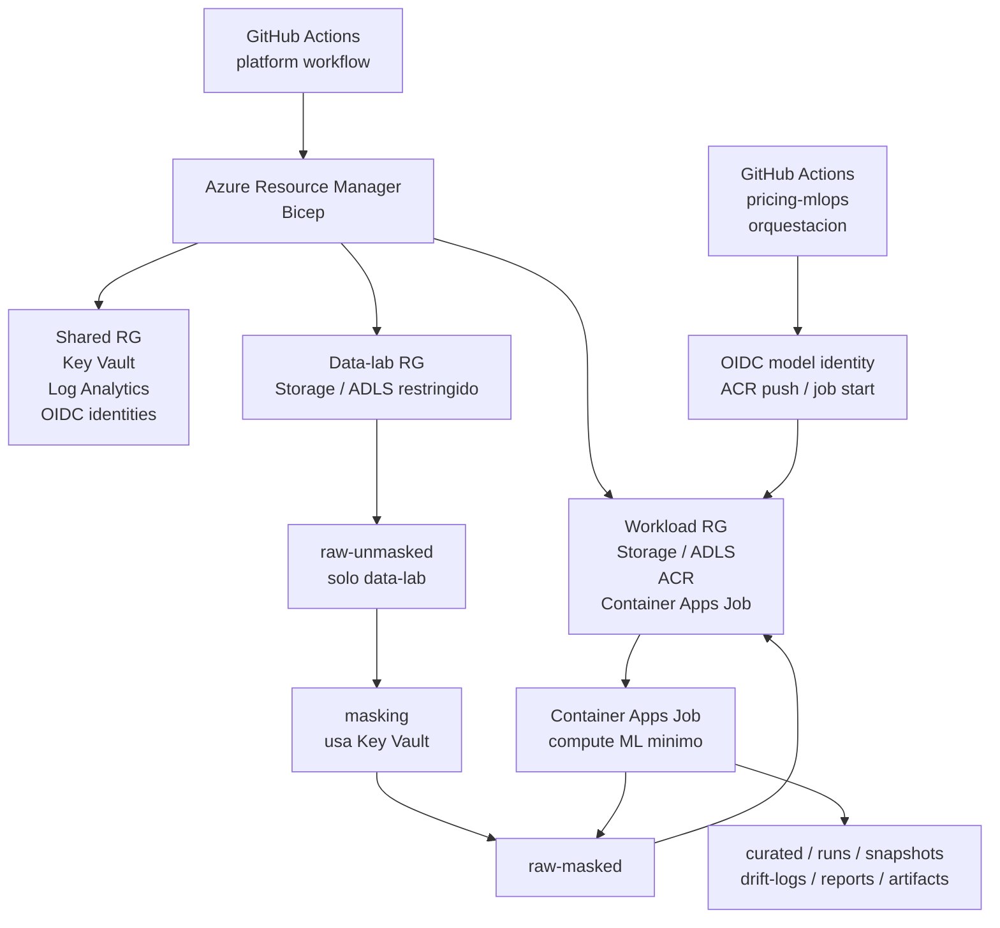

# pricing-mlops-platform

Plataforma Azure para el MVP de Pricing MLOps. Este repo gobierna infraestructura, ambientes, despliegues, contratos operativos y documentacion de plataforma.

No contiene el codigo operativo del modelo. Ese codigo vive en el repo funcional objetivo `pricing-mlops`.

## Responsabilidades

| Repo | Responsabilidad |
|---|---|
| `pricing-mlops-platform` | Azure, Bicep, foundation, workload infra, OIDC/RBAC, Storage/ADLS, Key Vault, Log Analytics y runbooks. |
| `pricing-mlops` | Validacion, curated/features, scoring, drift, reportes y artefactos de corrida. |
| `pricing-mlops-eda` | Referencia historica/documental y EDA inicial. No es el repo operativo objetivo. |

## Arquitectura



## Ambientes

| Ambiente | Resource Group | Uso | Unmasked |
|---|---|---|---|
| `shared` | `rg-pricing-mlops-platform-shared` | Servicios comunes: Key Vault, Log Analytics, identidades. No es ambiente MLOps. | No |
| `data-lab` | `rg-pricing-mlops-data-lab` | Landing restringido para datos sensibles y masking. | Si, restringido |
| `sandbox-local` | `rg-pricing-mlops-sbx-local` | Sandbox personal local/admin. No se opera desde GitHub Actions. | No |
| `staging` | `rg-pricing-mlops-staging` | MVP integrado con datos masked/curated y GitHub Actions del modelo. | No |
| `validation` | `rg-pricing-mlops-validation` | Validacion controlada no productiva futura. | No por default |

`prod` no existe en IaC, parameters ni workflows.

## Layout

```text
infra/
  foundation/
  workloads/pricing-mlops/
  parameters/

mlops/
  configs/
  docs/
  schemas/

scripts/
docs/
```

`mlops/` contiene contratos y reglas; no contiene IaC.

## Uso Rapido

Validar:

```bash
scripts/validate-mlops-contracts.py
az bicep build --file infra/foundation/main.bicep
az bicep build --file infra/workloads/pricing-mlops/main.bicep
az bicep build-params --file infra/parameters/sandbox-local.bicepparam
```

What-if/deploy local/admin de sandbox:

```bash
az login
az account set --subscription "<azure-subscription-name>"
scripts/what-if.sh sandbox-local
scripts/deploy.sh sandbox-local
```

GitHub Actions queda reservado para `staging` y `validation`. En el flujo MLOps real, GitHub Actions construye la imagen del repo `pricing-mlops`, la publica en Azure Container Registry e inicia un Azure Container Apps Job. El compute ML corre dentro de Azure, no en el runner de GitHub.

## Documentacion

Leer en este orden:

| Documento | Uso |
|---|---|
| [`docs/index.md`](docs/index.md) | Mapa de documentacion. |
| [`docs/quickstart.md`](docs/quickstart.md) | Comandos minimos. |
| [`docs/architecture.md`](docs/architecture.md) | Arquitectura actual. |
| [`docs/environments.md`](docs/environments.md) | Ambientes y Resource Groups. |
| [`docs/azure-services.md`](docs/azure-services.md) | Servicios Azure actuales y futuros. |
| [`docs/operations.md`](docs/operations.md) | Runbook operativo. |
| [`docs/github-actions.md`](docs/github-actions.md) | Workflows, OIDC y variables. |
| [`docs/platform-model-operating-contract.md`](docs/platform-model-operating-contract.md) | Contrato plataforma-modelo. |
| [`docs/data-governance-plan.md`](docs/data-governance-plan.md) | Gobierno de datos. |
| [`docs/roadmap.md`](docs/roadmap.md) | Fases recomendadas. |

Los planes largos anteriores fueron retirados de la ruta activa; `docs/archive/README.md` indica como consultar el historial si hace falta.

## Fuera De Alcance

- Produccion real.
- Azure ML, Data Factory, SQL, Hub-Spoke y Private Endpoints.
- Datos `raw-unmasked` en `sandbox-local`, `staging` o `validation`.
- Account keys, connection strings o secretos versionados.
