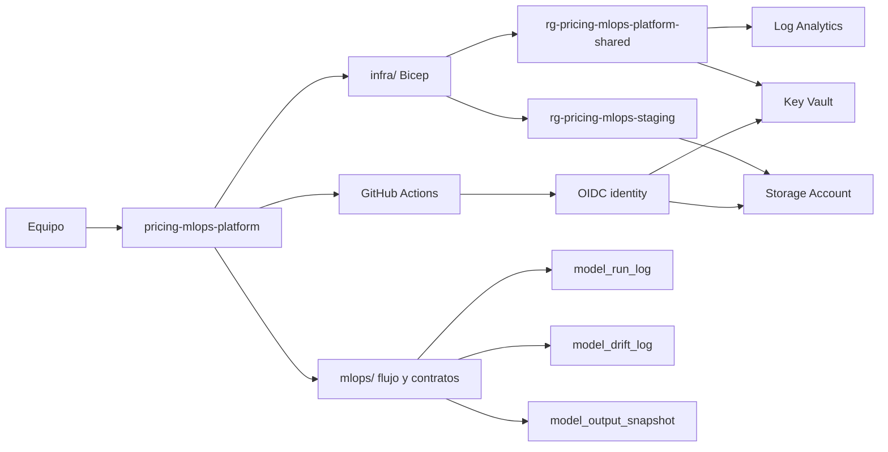

# pricing-mlops-platform

Monorepo minimo para operar el MVP de MLOps del sistema de recomendacion de precios B2B.

El repositorio incluye dos cosas que deben evolucionar juntas durante el MVP:

- Infraestructura Azure minima con Bicep.
- Definicion operativa del flujo MLOps: contratos, configuracion, scripts y workflows.

La filosofia es deliberada: un repo, pocos ambientes, pocos recursos, una identidad de GitHub Actions y despliegues controlados.

## Subscription

El MVP usa una sola subscription:

```text
<azure-subscription-name>
Credito incluido: 200 USD
```

No se crean subscriptions separadas por ambiente. La separacion se hace con Resource Groups, tags y disciplina operativa. Esto mantiene el proyecto barato y entendible para un equipo pequeno.

## Arquitectura



## Que contiene

```text
infra/
  main.bicep
  parameters/sandbox-david.bicepparam
  parameters/staging.bicepparam
  parameters/validation.bicepparam

mlops/
  configs/
  docs/
  schemas/

scripts/
  deploy.sh
  what-if.sh
  destroy-sandbox.sh
  run-mlops-staging.py
  validate-mlops-contracts.py

docs/
  architecture.md
  operations.md
  platform-environments.md
  repository-governance.md
  sandbox.md

.github/workflows/
  infra.yml
  platform-infra.yml
  mlops.yml
```

## Recursos Azure MVP

| Recurso | Proposito |
|---|---|
| Shared Resource Group | Key Vault, Log Analytics e identidad OIDC |
| Staging Resource Group | Storage y evidencia MLOps |
| Sandbox David Resource Group | Storage hello world para pruebas personales temporales |
| Validation Resource Group | Storage hello world no productivo para validacion controlada |
| Storage Account | Inputs, baselines, runs, snapshots, drift logs, reportes y artefactos |
| Key Vault | Secretos y parametros sensibles si aparecen |
| Log Analytics | Observabilidad tecnica minima |
| Budget | Alerta mensual opcional a nivel suscripcion |
| User Assigned Identity | Una identidad para GitHub Actions via OIDC |

No se incluye Kubernetes, Azure ML, Databricks, Terraform, Ansible, multiples repos ni multiples ambientes permanentes.

## Uso local

```bash
az login
az account set --subscription "<azure-subscription-name>"

scripts/what-if.sh staging
scripts/deploy.sh staging
```

Ambientes permitidos para el prototipo de plataforma:

```text
staging
sandbox-david
validation
```

Los scripts de despliegue no crean el repo, no asignan usuarios y no hacen bootstrap de permisos. Solo ejecutan comandos repetibles contra Bicep.

Validar contratos MLOps:

```bash
scripts/validate-mlops-contracts.py
```

Generar una corrida staging de ejemplo:

```bash
scripts/run-mlops-staging.py --environment staging
```

Los artefactos locales se escriben en `outputs/`, que no se versiona.

El workflow `platform-infra.yml` valida Bicep en pull requests sin hacer login a Azure ni desplegar. En `workflow_dispatch` puede ejecutar `validate`, `what-if` o `deploy` para `staging` o `validation`, siempre usando el GitHub environment correspondiente. Los sandboxes personales como `sandbox-david` se operan localmente por cada companero. El primer bootstrap de OIDC puede requerir despliegue local con permisos administrativos antes de que GitHub Actions pueda hacer what-if o deploy.

El budget recomendado es 180 USD para dejar margen antes de consumir los 200 USD incluidos.

## Configuracion GitHub OIDC

1. Editar el parameter file del ambiente que se quiere habilitar.
2. Configurar `githubRepository` con el formato `org/repo`.
3. Desplegar infraestructura.
4. Copiar el output `githubActionsClientId`.
5. Crear variables en el GitHub environment correspondiente:

```text
AZURE_CLIENT_ID
AZURE_TENANT_ID
AZURE_SUBSCRIPTION_ID
AZURE_STORAGE_ACCOUNT
```

El workflow `mlops.yml` puede ejecutar la corrida staging y, opcionalmente, subir artefactos al Storage Account usando OIDC.

Mas detalle operativo:

- `docs/platform-environments.md`
- `docs/repository-governance.md`
- `docs/operations.md`

## Regla de separacion

Mantener todo aqui mientras el proyecto sea MVP. Separar el codigo de pricing a otro repo solo si:

- el modelo se vuelve producto independiente;
- hay releases propios del paquete de pricing;
- el equipo crece y necesita ownership separado;
- el repositorio empieza a tener ciclos de cambio claramente distintos.

Antes de eso, separar seria complejidad prematura.
