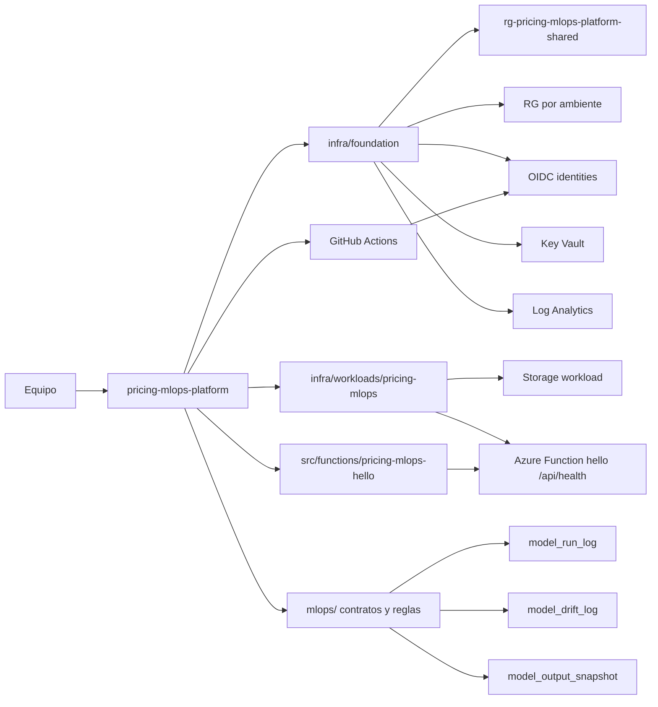

# pricing-mlops-platform

Monorepo minimo para operar el MVP de MLOps del sistema de recomendacion de precios B2B.

El repositorio separa dos capas que evolucionan juntas durante el MVP:

- `infra/foundation`: base reusable de plataforma Azure.
- `infra/workloads/pricing-mlops`: infraestructura especifica del workload Pricing MLOps.

`mlops/` no contiene IaC. Se mantiene para contratos, schemas, thresholds, reglas y validaciones del flujo del modelo.

## Subscription

El MVP usa una sola subscription:

```text
<azure-subscription-name>
Credito incluido: 200 USD
```

No se crean subscriptions separadas por ambiente. La separacion se hace con Resource Groups, tags y disciplina operativa.

## Arquitectura



## Que contiene

```text
infra/
  foundation/
    main.bicep
    modules/
      resource-groups.bicep
      shared-services.bicep
      identities.bicep
      observability.bicep
  workloads/
    pricing-mlops/
      main.bicep
      modules/
        hello-function.bicep
        storage.bicep
  parameters/
    data-lab.bicepparam
    sandbox-david.bicepparam
    staging.bicepparam
    validation.bicepparam

src/
  functions/pricing-mlops-hello/

mlops/
  configs/
  docs/
  schemas/
```

## Recursos Azure MVP

| Capa | Recurso | Proposito |
|---|---|---|
| Foundation | Shared Resource Group | Key Vault, Log Analytics e identidades OIDC |
| Foundation | Workload Resource Groups | Separacion por ambiente |
| Foundation | User Assigned Identities | OIDC para GitHub Actions |
| Foundation | Budget | Alerta mensual opcional a nivel subscription |
| Pricing MLOps workload | Storage Account | Raw masked/unmasked controlado, curated, baselines, runs, snapshots, drift logs, reportes y artefactos |
| Pricing MLOps workload | Function App | Hello world / health check del prototipo |

La Function App usa App Service Plan `B1` por defecto. La subscription debe tener cuota `Basic VMs >= 1`; si no, foundation y storage pueden quedar desplegados, pero la Function App queda bloqueada por cuota de Azure.

`data-lab` usa `eastus2` como scope controlado para CSVs unmasked/masked. No despliega Function App ni otorga acceso de datos a GitHub Actions por defecto.

`sandbox-david` usa `centralus` para probar App Service/Functions fuera de `eastus2`, donde la cuenta con credito gratis reporto quota 0 para compute. `staging` y `validation` se mantienen en `eastus2`.

Si el sandbox ya fue desplegado en otra region, Azure no mueve Storage Accounts ni Function Apps en sitio. Para aplicar el cambio de region hay que recrear el Resource Group del sandbox o cambiar nombres.

Para validar solo foundation y storage mientras se resuelve cuota de compute:

```bash
ENABLE_HELLO_FUNCTION=false scripts/deploy.sh sandbox-david
```

No se incluye Kubernetes, Azure ML, Data Factory, Azure SQL, Hub-and-Spoke, Private Endpoints, ACR, Terraform, Ansible ni produccion real.

## Uso local

```bash
az login
az account set --subscription "<azure-subscription-name>"

scripts/what-if.sh sandbox-david
scripts/deploy.sh sandbox-david
```

Ambientes permitidos:

```text
staging
sandbox-david
validation
data-lab
```

Los scripts ejecutan en orden:

1. `infra/foundation/main.bicep`
2. `infra/workloads/pricing-mlops/main.bicep`

Validar contratos MLOps:

```bash
scripts/validate-mlops-contracts.py
```

Validar Function hello world localmente:

```bash
npm test --prefix src/functions/pricing-mlops-hello
```

Publicar el codigo de la Function despues de desplegar infraestructura:

```bash
scripts/publish-hello-function.sh sandbox-david
```

## GitHub Actions

`platform-infra.yml` valida Bicep en pull requests sin hacer login a Azure ni desplegar.

En `workflow_dispatch` puede ejecutar `validate`, `what-if` o `deploy` para:

```text
staging
sandbox-david
validation
```

`data-lab` se compila en CI, pero su bootstrap inicial se recomienda local/admin para no entregar acceso por defecto de GitHub Actions a `raw-unmasked`.

Cada GitHub environment usado para what-if o deploy necesita:

```text
AZURE_CLIENT_ID
AZURE_TENANT_ID
AZURE_SUBSCRIPTION_ID
AZURE_STORAGE_ACCOUNT
```

El primer bootstrap de OIDC puede requerir despliegue local con permisos administrativos antes de que GitHub Actions pueda hacer what-if o deploy.

## Regla de separacion

Mantener todo aqui mientras el proyecto sea MVP. Separar el codigo de pricing a otro repo solo si:

- el modelo se vuelve producto independiente;
- hay releases propios del paquete de pricing;
- el equipo crece y necesita ownership separado;
- el repositorio empieza a tener ciclos de cambio claramente distintos.

Antes de eso, separar seria complejidad prematura.
