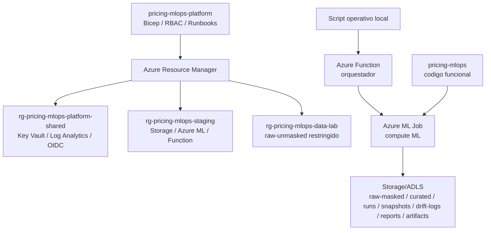

# pricing-mlops-platform

Plataforma Azure para el MVP de Pricing MLOps. Este repo gobierna infraestructura, ambientes, RBAC/OIDC, Storage/ADLS, Azure ML, Azure Functions y runbooks de operacion.

El codigo funcional del flujo vive en `pricing-mlops`. La referencia historica/EDA vive en `pricing-mlops-eda`.

## Estado Actual

```text
Operador o prueba controlada
-> Azure Function /api/model-flow
-> Azure ML command job
-> Storage/ADLS outputs versionados
```

GitHub Actions no es el orquestador operativo del flujo ML. En este repo solo valida o despliega infraestructura por `workflow_dispatch`.

## Arquitectura



## Ambientes

| Scope | Resource Group | Uso | Estado |
|---|---|---|---|
| `shared` | `rg-pricing-mlops-platform-shared` | Key Vault, Log Analytics, identidades OIDC. No es ambiente MLOps. | Activo |
| `data-lab` | `rg-pricing-mlops-data-lab` | Landing restringido para unmasked y masking. | Preparado |
| `sandbox-local` | `rg-pricing-mlops-sbx-local` | Sandbox local/admin, no GitHub Actions. | Preparado |
| `staging` | `rg-pricing-mlops-staging` | MVP operativo con Storage, Azure ML y Function. | Activo |
| `validation` | `rg-pricing-mlops-validation` | No-prod controlado futuro. | Preparado |

`prod` no existe en IaC, parameters ni workflows.

## Comandos

Validar:

```bash
scripts/validate-mlops-contracts.py
az bicep build --file infra/foundation/main.bicep
az bicep build --file infra/workloads/pricing-mlops/main.bicep
az bicep build-params --file infra/parameters/staging.bicepparam
az bicep build-params --file infra/parameters/validation.bicepparam
az bicep build-params --file infra/parameters/data-lab.bicepparam
az bicep build-params --file infra/parameters/sandbox-local.bicepparam
```

What-if/deploy:

```bash
az login
az account set --subscription "<azure-subscription-name>"
scripts/what-if.sh staging
scripts/deploy.sh staging
```

Operar el flujo ML se hace desde `pricing-mlops` con `scripts/run_model_flow_function.sh`.

## Documentacion

Leer en este orden:

1. [`docs/index.md`](docs/index.md)
2. [`docs/architecture.md`](docs/architecture.md)
3. [`docs/operations.md`](docs/operations.md)
4. [`docs/github-actions.md`](docs/github-actions.md)
5. [`docs/platform-model-operating-contract.md`](docs/platform-model-operating-contract.md)
6. [`docs/data-governance-plan.md`](docs/data-governance-plan.md)
7. [`docs/roadmap.md`](docs/roadmap.md)
8. [`docs/original/technical-design-original.md`](docs/original/technical-design-original.md)

## Fuera De Alcance

- Produccion real.
- ADF, SQL, Private Endpoints, Hub-Spoke y endpoints online de Azure ML.
- Datos `raw-unmasked` en `sandbox-local`, `staging` o `validation`.
- Account keys, connection strings o secretos versionados.
