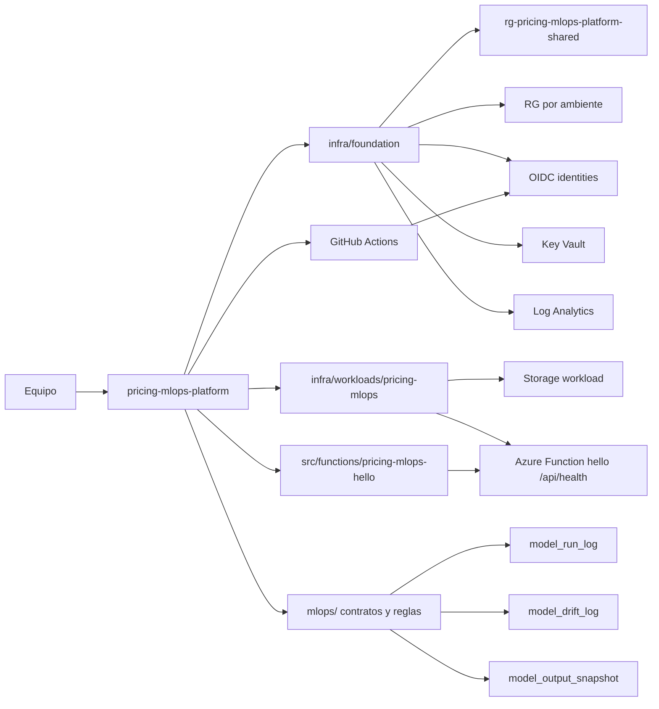
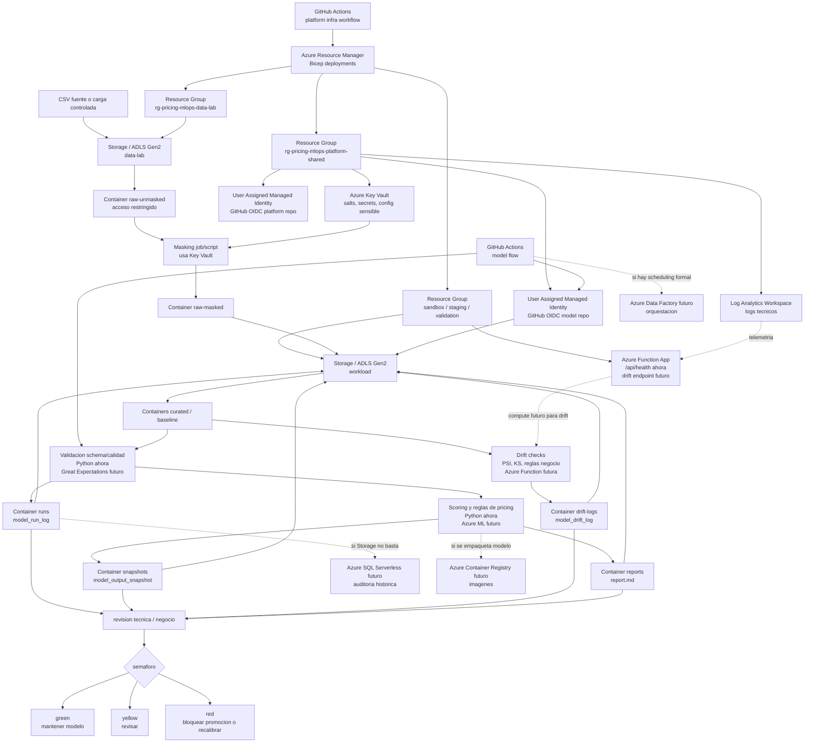

# pricing-mlops-platform

Monorepo minimo para operar el MVP de MLOps del sistema de recomendacion de precios B2B.

El repositorio separa dos capas que evolucionan juntas durante el MVP:

- `infra/foundation`: base reusable de plataforma Azure.
- `infra/workloads/pricing-mlops`: infraestructura especifica del workload Pricing MLOps.

`mlops/` no contiene IaC. Se mantiene para contratos, schemas, thresholds, reglas y validaciones del flujo del modelo.

## Subscription

El MVP usa una sola subscription:

```text
<azure-subscription-name>
Credito incluido: 200 USD
```

No se crean subscriptions separadas por ambiente. La separacion se hace con Resource Groups, tags y disciplina operativa.

## Arquitectura



## Pipeline MLOps

El pipeline MLOps separa la plataforma Azure del codigo funcional del modelo. Este repo despliega y gobierna recursos; el repo funcional objetivo `pricing-mlops` ejecuta validaciones, scoring, drift y publicacion de artefactos.



Servicios Azure por parte del pipeline:

| Parte del pipeline | Servicio Azure | Resource Group esperado | Estado |
|---|---|---|---|
| Foundation compartida | Resource Group, Key Vault, Log Analytics, User Assigned Managed Identities, OIDC | `rg-pricing-mlops-platform-shared` | Implementado como base del PoC |
| Carga controlada de datos | Storage Account / ADLS Gen2 containers | `rg-pricing-mlops-data-lab` o `rg-pricing-mlops-secure-sandbox` | Preparado para PoC; `raw-unmasked` requiere acceso restringido |
| Secretos de masking | Azure Key Vault | `rg-pricing-mlops-platform-shared` | Foundation compartida |
| Datos masked y curated | Storage Account / ADLS Gen2 containers `input`, `raw-masked`, `curated`, `baseline` | `rg-pricing-mlops-sbx-david`, luego `rg-pricing-mlops-staging` | PoC en sandbox, promocion futura a staging |
| Validacion de schema/calidad | GitHub Actions del repo `pricing-mlops`; futuro Azure Functions o Azure ML si se justifica | No crea RG propio; consume Storage/ADLS | Local/CI primero |
| Scoring y reglas de pricing | Scripts del repo `pricing-mlops`; futuro Azure Functions, Azure ML o ADF segun necesidad | Workload RG del ambiente | Local/CI primero; servicio administrado futuro |
| Drift checks | Scripts del repo `pricing-mlops`; futuro Azure Function drift endpoint | Workload RG del ambiente | PoC con scripts; Function futura |
| Health endpoint | Azure Function App | `rg-pricing-mlops-sbx-david` | Hello world del prototipo, condicionado a quota de App Service |
| Artefactos MLOps | Storage Account / ADLS Gen2 containers `runs`, `snapshots`, `drift-logs`, `reports`, `artifacts` | Workload RG del ambiente | PoC en sandbox |
| Observabilidad tecnica | Log Analytics; futuro Azure Monitor alerts | `rg-pricing-mlops-platform-shared` | Log Analytics ahora; alertas despues |
| Auditoria historica consultable | Storage JSON/Parquet ahora; futuro Azure SQL Serverless | Futuro `rg-pricing-mlops-validation` o RG audit | SQL no se despliega en PoC |
| Orquestacion formal | GitHub Actions manual ahora; futuro Azure Data Factory | Futuro workload RG controlado | ADF no se despliega en PoC |
| Empaquetado de modelo | No requerido ahora; futuro Azure Container Registry si hay contenedores | Futuro shared o workload controlado | ACR fuera del PoC |

Reglas principales:

- `shared` guarda servicios comunes, no datasets.
- `raw-unmasked` solo vive en `data-lab` o `secure-sandbox` con acceso restringido.
- `staging` y `validation` consumen datos `masked`, `curated` o sinteticos.
- `pricing-mlops-platform` no ejecuta scoring productivo.
- `pricing-mlops` no crea Resource Groups, Key Vault, Storage Accounts ni permisos permanentes.
- `pricing-mlops` usa una identidad OIDC separada con `Storage Blob Data Contributor` solo sobre el Storage Account del workload.
- `sandbox-david` no crea ni entrega acceso a `raw-unmasked`.
- `prod` sigue fuera de alcance.

## Que contiene

```text
infra/
  foundation/
    main.bicep
    modules/
      resource-groups.bicep
      shared-services.bicep
      identities.bicep
      observability.bicep
  workloads/
    pricing-mlops/
      main.bicep
      modules/
        hello-function.bicep
        storage.bicep
  parameters/
    data-lab.bicepparam
    sandbox-david.bicepparam
    staging.bicepparam
    validation.bicepparam

src/
  functions/pricing-mlops-hello/

mlops/
  configs/
  docs/
  schemas/
```

## Documentacion

Leer en este orden:

| Documento | Uso |
|---|---|
| [`docs/index.md`](docs/index.md) | Mapa de documentacion. |
| [`docs/quickstart.md`](docs/quickstart.md) | Comandos minimos para validar, what-if y deploy. |
| [`docs/architecture.md`](docs/architecture.md) | Arquitectura actual de plataforma. |
| [`docs/environments.md`](docs/environments.md) | Ambientes, Resource Groups, tags y reglas de sandbox. |
| [`docs/azure-services.md`](docs/azure-services.md) | Servicios Azure actuales y futuros. |
| [`docs/operations.md`](docs/operations.md) | Runbook operativo local y GitHub. |
| [`docs/github-actions.md`](docs/github-actions.md) | Workflows, OIDC y variables por environment. |
| [`docs/platform-model-operating-contract.md`](docs/platform-model-operating-contract.md) | Contrato entre plataforma y repo modelo. |
| [`docs/data-governance-plan.md`](docs/data-governance-plan.md) | Gobierno de datos y zonas. |
| [`docs/roadmap.md`](docs/roadmap.md) | Fases recomendadas. |

Los planes largos anteriores viven en `docs/archive/` como referencia historica.

## Recursos Azure MVP

| Capa | Recurso | Proposito |
|---|---|---|
| Foundation | Shared Resource Group | Key Vault, Log Analytics e identidades OIDC |
| Foundation | Workload Resource Groups | Separacion por ambiente |
| Foundation | User Assigned Identities | OIDC para GitHub Actions |
| Foundation | Budget | Alerta mensual opcional a nivel subscription |
| Pricing MLOps workload | Storage Account | Raw masked, curated, baselines, runs, snapshots, drift logs, reportes y artefactos |
| Pricing MLOps workload | Function App | Hello world / health check del prototipo |

La Function App usa App Service Plan `B1` por defecto. La subscription debe tener cuota `Basic VMs >= 1`; si no, foundation y storage pueden quedar desplegados, pero la Function App queda bloqueada por cuota de Azure.

`data-lab` usa `eastus2` como scope controlado para CSVs unmasked/masked. No despliega Function App ni otorga acceso de datos a GitHub Actions por defecto. `sandbox-david` usa `input`, `raw-masked`, `curated`, `baseline`, `runs`, `snapshots`, `drift-logs`, `reports` y `artifacts`; no crea `raw-unmasked`.

`sandbox-david` usa `eastus2` para respetar los recursos existentes en `rg-pricing-mlops-sbx-david`. Mientras App Service/Functions siga bloqueado por cuota, el despliegue mínimo debe ejecutarse con `ENABLE_HELLO_FUNCTION=false` para validar Storage, OIDC y RBAC sin recrear recursos. `staging` y `validation` se mantienen en `eastus2`.

Azure no mueve Storage Accounts ni Function Apps en sitio. Para aplicar un cambio de region hay que recrear el Resource Group del sandbox o cambiar nombres con confirmacion explicita.

Para validar solo foundation y storage mientras se resuelve cuota de compute:

```bash
ENABLE_HELLO_FUNCTION=false scripts/deploy.sh sandbox-david
```

No se incluye Kubernetes, Azure ML, Data Factory, Azure SQL, Hub-and-Spoke, Private Endpoints, ACR, Terraform, Ansible ni produccion real.

## Uso local

```bash
az login
az account set --subscription "<azure-subscription-name>"

scripts/what-if.sh sandbox-david
scripts/deploy.sh sandbox-david
```

Ambientes permitidos:

```text
staging
sandbox-david
validation
data-lab
```

Los scripts ejecutan en orden:

1. `infra/foundation/main.bicep`
2. `infra/workloads/pricing-mlops/main.bicep`

Validar contratos MLOps:

```bash
scripts/validate-mlops-contracts.py
```

Validar Function hello world localmente:

```bash
npm test --prefix src/functions/pricing-mlops-hello
```

Publicar el codigo de la Function despues de desplegar infraestructura:

```bash
scripts/publish-hello-function.sh sandbox-david
```

## GitHub Actions

`platform-infra.yml` valida Bicep en pull requests sin hacer login a Azure ni desplegar.

En `workflow_dispatch` puede ejecutar `validate`, `what-if` o `deploy` para:

```text
staging
sandbox-david
validation
```

`data-lab` se compila en CI, pero su bootstrap inicial se recomienda local/admin para no entregar acceso por defecto de GitHub Actions a `raw-unmasked`.

Cada GitHub environment usado para what-if o deploy necesita:

```text
AZURE_CLIENT_ID
AZURE_TENANT_ID
AZURE_SUBSCRIPTION_ID
AZURE_STORAGE_ACCOUNT
```

Para el repo funcional `tecmx-team46-pricing/pricing-mlops`, el environment `sandbox-david` debe usar el output `modelGithubActionsClientId` como `AZURE_CLIENT_ID`. Esa identidad nueva se llama `id-gha-pricing-mlops-model-sandbox-david`. La identidad actual del repo plataforma se mantiene como `id-gha-pricing-mlops-sandbox-david` para no romper despliegues existentes. La identidad modelo no recibe `Owner`, no recibe `Contributor` de subscription y no recibe acceso a `raw-unmasked`; solo puede leer/escribir blobs en el Storage Account del workload.

El primer bootstrap de OIDC puede requerir despliegue local con permisos administrativos antes de que GitHub Actions pueda hacer what-if o deploy.

## Regla de separacion

Mantener aqui la plataforma, IaC, contratos y operacion del MVP. El repo funcional del modelo, cuando se cree siguiendo el nombre del documento de avance, debe ser `pricing-mlops`.

Separar o mover codigo ejecutable de pricing a `pricing-mlops` solo si:

- el modelo se vuelve producto independiente;
- hay releases propios del paquete de pricing;
- el equipo crece y necesita ownership separado;
- el repositorio empieza a tener ciclos de cambio claramente distintos.

`pricing-mlops-eda` queda como repo de referencia historica/documental y EDA inicial, no como nombre objetivo para el repo operativo del modelo.
