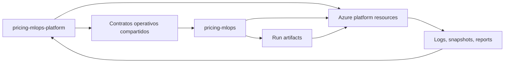

# Multi-Repo MLOps Deployment Plan

## Proposito

Este plan redefine el despliegue MLOps de Pricing Intelligence como una arquitectura de dos repositorios:

| Repo | Rol | Alcance principal |
|---|---|---|
| `pricing-mlops-platform` | Plataforma e infraestructura | Gobierno de Azure, IaC, ambientes, identidades, storage, observabilidad, despliegues y contratos operativos compartidos. |
| `pricing-mlops` | Data lab y ejecucion de modelo | Notebooks, scripts de scoring, validaciones de datos, generacion de artefactos, uso de datasets y logica estadistica del modelo. |

La decision corrige el acoplamiento del MVP monorepo: `pricing-mlops-platform` no debe convertirse en el repo del modelo. Este repo conserva IaC, gobierno y documentacion operativa; el codigo de modelo y scoring debe vivir y evolucionar en `pricing-mlops`.

## Fuentes revisadas

- Documentacion actual de plataforma: `README.md`, `docs/architecture.md`, `docs/platform-environments.md`, `docs/repository-governance.md`, `docs/operations.md`, `docs/poc-mlops-services-plan.md`.
- IaC actual: `infra/foundation/`, `infra/workloads/pricing-mlops/`, `infra/parameters/`.
- Workflows actuales: `.github/workflows/platform-infra.yml`, `.github/workflows/infra.yml`, `.github/workflows/mlops.yml`.
- Repo `pricing-mlops-eda`: contiene `Avance1_Equipo_46_EDA.ipynb`, `Avance0.Equipo46.pdf`, `Diseño Técnico_ Arquitectura MLOps.pdf` y `README.md`; se usa como referencia historica/documental y EDA inicial.
- PDF `Avance0.Equipo46.pdf`: propone `pricing-mlops/` como estructura del repositorio funcional MLOps y `pricing-mlops-infra/` como repositorio independiente de infraestructura.
- PDF `Diseño Técnico_ Arquitectura MLOps.pdf`: define el objetivo conceptual con ADF, ADLS Gen2, Azure Functions Flex, Azure ML, Azure SQL Serverless, Key Vault, Private Endpoints, Hub-and-Spoke, Great Expectations, drift PSI/KS y auditoria por `model_run_log`.

## Principios de separacion

1. `pricing-mlops-platform` gobierna recursos cloud, permisos, despliegues y ambientes. No contiene notebooks productivos, entrenamiento, scoring ni datasets.
2. `pricing-mlops` gobierna logica de datos/modelo. No crea infraestructura Azure por su cuenta, salvo pruebas locales o mocks sin recursos reales.
3. Los repos se comunican por contratos versionados, artefactos y recursos Azure, no copiando secretos ni datos por Git.
4. Los datos sensibles no se versionan en ningun repo. Se almacenan en Azure Storage/ADLS con RBAC, identidades administradas y secretos en Key Vault.
5. `prod` sigue conceptual. La plataforma actual habilita `data-lab`, `sandbox-david`, `staging` y `validation`.

## Responsabilidades por repo

### `pricing-mlops-platform`

Debe contener:

- IaC Bicep de foundation y workload.
- Definicion de Resource Groups, tags, budgets y ambientes.
- Key Vault, Log Analytics, identidades OIDC y RBAC base.
- Storage/ADLS y contenedores requeridos por el flujo MLOps.
- Observabilidad, convenciones de logs, alertas futuras y auditoria operativa.
- Workflows de validacion IaC, what-if, deploy y bootstrap controlado.
- Documentacion de ambientes, operaciones y gobierno.
- Contratos compartidos de interfaz cuando sean necesarios para validar integracion entre repos.

No debe contener:

- Notebooks de analisis exploratorio.
- CSVs, Parquet o extractos de datos reales.
- Codigo propietario de scoring o feature engineering.
- Entrenamiento, reentrenamiento o notebooks de calibracion.
- Secrets, salts, connection strings o credenciales.

El directorio actual `mlops/` debe tratarse como contratos y evidencia minima del MVP. En el modelo multi-repo, esos contratos pueden permanecer aqui como referencia de plataforma o moverse gradualmente a un paquete/contrato compartido, pero la implementacion ejecutable del modelo pertenece a `pricing-mlops`.

### `pricing-mlops`

Debe contener:

- Notebooks de EDA y experimentacion.
- Scripts versionables para preparacion de features, validacion, drift y scoring.
- Definiciones Great Expectations o validadores equivalentes.
- Codigo que genera `model_output_snapshot`, `model_drift_log`, reportes y artefactos.
- Pruebas unitarias de transformaciones, reglas de negocio y metricas estadisticas.
- Uso de datasets desde Azure Storage/ADLS mediante identidades o credenciales federadas, sin datos en Git.
- Documentacion de datasets esperados, columnas, reglas y supuestos del modelo.

No debe contener:

- Bicep/Terraform para crear recursos compartidos de Azure.
- Role assignments permanentes.
- Connection strings, salts de hashing, secretos o keys.
- Workflows que desplieguen foundation, red, storage o Key Vault.

## Servicios Azure gobernados por plataforma

| Servicio | Estado actual o futuro | Responsable | Uso |
|---|---|---|---|
| Resource Groups | Actual | Plataforma | Separacion por `shared`, `data-lab`, `sandbox-david`, `staging` y `validation`. |
| Tags y budgets | Actual | Plataforma | Gobierno de costo y lifecycle en una sola subscription. |
| User Assigned Managed Identities | Actual | Plataforma | OIDC para GitHub Actions y ejecuciones sin secretos persistentes. |
| Key Vault | Actual | Plataforma | Secrets, salts de hashing, configuracion sensible y referencias de credenciales. |
| Log Analytics | Actual | Plataforma | Observabilidad tecnica de despliegues, Functions y validaciones futuras. |
| Storage Account / ADLS Gen2 | Actual como Storage; objetivo ADLS | Plataforma | Raw masked/unmasked controlado, curated, baselines, runs, snapshots, drift logs, reports y artifacts. |
| Azure Functions | Actual hello/health; objetivo Flex | Plataforma despliega, modelo aporta codigo si aplica | Health, drift engine, orquestacion liviana o endpoint operativo. |
| Azure SQL Serverless | Futuro conceptual | Plataforma | Auditoria historica de `model_run_log`, drift y metadata de snapshots cuando Storage no baste. |
| Azure ML | Futuro conceptual | Plataforma provisiona, modelo opera | Registro de modelos, validacion, scoring y ejecuciones controladas. |
| Azure Data Factory | Futuro conceptual | Plataforma provisiona, integracion con modelo | Ingesta, scheduling y disparo de flujos cuando existan fuentes formales. |
| ACR | Futuro conceptual | Plataforma | Imagenes de validadores/modelo si la ejecucion se empaqueta como contenedor. |
| VNet, Private Endpoints, Private DNS, Hub-and-Spoke | Futuro conceptual | Plataforma | Seguridad enterprise antes de datos productivos o integracion privada. |
| Azure Monitor alerts | Futuro | Plataforma | Alertas sobre drift rojo, fallas de ejecucion, costos y disponibilidad. |

## Procesos gobernados por el repo modelo

`pricing-mlops` debe implementar y probar:

- Lectura de datasets desde rutas Azure autorizadas.
- Enmascaramiento o validacion del estado de enmascaramiento cuando aplique.
- Perfilado de datos y generacion de estadisticos base.
- Reglas criticas del PDF:
  - tolerancia inteligente a nulos en `current_cost_orders`;
  - unicidad de `[kpn, vpareadescription, distysegment]` en outputs;
  - monotonicidad `P0_PRICE <= P20_PRICE <= P50_PRICE <= P85_PRICE <= P100_PRICE`;
  - consistencia de margen cuando `P20_Was_Adjusted=true`.
- Validaciones Great Expectations o equivalentes.
- Calculo de drift con PSI, KS y pruebas de proporcion cuando correspondan.
- Generacion de semaforo `green`, `yellow`, `red`.
- Scoring con modelo campeon o logica vigente.
- Escritura de outputs inmutables y metadatos de corrida.
- Reportes humanos para revision de Pricing BI/Product.

## Interaccion entre repos

Flujo esperado:

1. Plataforma despliega o valida foundation y workload por ambiente.
2. Plataforma publica outputs no secretos: nombres de storage, contenedores, Key Vault, Log Analytics, Function App y endpoints permitidos.
3. Repo modelo obtiene configuracion por GitHub environment variables, Azure App Configuration futura o outputs documentados; los secretos se resuelven en Azure.
4. Repo modelo ejecuta validacion, feature engineering, drift y scoring.
5. Repo modelo escribe artefactos en Storage/ADLS usando identidad autorizada.
6. Plataforma observa, audita y protege el ambiente; no interpreta internamente la logica del modelo.

## Datos intercambiados

| Dato o artefacto | Productor | Consumidor | Ubicacion recomendada |
|---|---|---|---|
| Dataset raw unmasked | Fuente controlada | Proceso de enmascaramiento autorizado | Storage/ADLS `raw-unmasked`, solo sandbox o entorno cerrado. |
| Dataset raw masked | Proceso de enmascaramiento | Repo modelo | Storage/ADLS `raw-masked` o `input`. |
| Features curated | Repo modelo | Scoring, drift y auditoria | Storage/ADLS `curated`. |
| Baselines | Repo modelo | Drift engine | Storage/ADLS `baseline`. |
| `model_run_log` | Repo modelo o Function/ADF | Plataforma y auditoria | Storage `runs`; futuro SQL Serverless. |
| `model_drift_log` | Repo modelo o Function | Plataforma, negocio y auditoria | Storage `drift-logs`; futuro SQL Serverless. |
| `model_output_snapshot` | Repo modelo | BI/downstream/auditoria | Storage `snapshots` como Parquet/JSONL inmutable. |
| Reportes humanos | Repo modelo | Equipo tecnico y negocio | Storage `reports` y GitHub artifact no sensible. |
| Artefactos de validacion | Repo modelo | Plataforma y reviewers | Storage `artifacts` o GitHub artifacts sin datos sensibles. |

## Secretos y configuracion compartida

No se comparten secretos por Git. La separacion correcta es:

| Tipo | Donde vive | Como se consume |
|---|---|---|
| Salt/llave de hashing | Azure Key Vault | Identidad administrada, OIDC o referencia de Key Vault. |
| Connection strings | Evitar cuando sea posible | Preferir RBAC y `az login`/OIDC; si existen, Key Vault. |
| IDs de tenant/subscription/client | GitHub environment variables | No son secretos por si solos, pero se administran por ambiente. |
| Nombres de storage/contenedores | Outputs de plataforma o variables de ambiente | GitHub Actions del repo modelo. |
| Thresholds aprobados | Contrato versionado o config en Storage/App Configuration futura | Repo modelo los lee por version. |
| Credenciales de sistemas fuente | Key Vault | ADF/Functions/AML con identidad administrada. |
| Endpoints privados | Outputs de plataforma | Consumidos por runners/agents autorizados. |

La plataforma debe evitar entregar keys de cuenta de Storage al repo modelo. El acceso debe ser por federacion OIDC, Managed Identity o RBAC de minimo privilegio.

## GitHub Actions por repo

### `pricing-mlops-platform`

Workflows recomendados:

| Workflow | Trigger | Responsabilidad |
|---|---|---|
| `platform-infra.yml` | PR y `workflow_dispatch` | Compilar Bicep, validar parameter files, ejecutar `what-if` y `deploy` manual por ambiente. |
| `platform-contracts.yml` | PR | Validar schemas/contratos compartidos sin ejecutar modelo. |
| `platform-observability.yml` | `workflow_dispatch` | Validar queries, alertas y configuracion operativa cuando existan. |
| `sandbox-cleanup.yml` | Manual o schedule futuro | Reportar o destruir sandboxes expirados con aprobacion. |

El workflow actual `.github/workflows/mlops.yml` no debe crecer como pipeline de scoring. En el plan multi-repo debe limitarse a contratos de plataforma o retirarse cuando `pricing-mlops` tenga su propio pipeline.

### `pricing-mlops`

Workflows recomendados:

| Workflow | Trigger | Responsabilidad |
|---|---|---|
| `model-ci.yml` | PR | Ejecutar lint, pruebas unitarias, validadores con fixtures sinteticos y smoke tests de notebooks/scripts. |
| `data-contract-ci.yml` | PR | Validar Great Expectations o contratos equivalentes contra samples sinteticos/masked. |
| `model-package.yml` | Tag o manual | Empaquetar codigo de scoring, generar version y publicar artefacto sin datos sensibles. |
| `run-sandbox.yml` | Manual | Ejecutar validacion/scoring contra `sandbox-david` usando OIDC y Storage autorizado. |
| `run-validation.yml` | Manual con aprobacion | Ejecutar corrida controlada en `validation` y publicar `runs`, `snapshots`, `drift-logs` y `reports`. |

El repo modelo no debe ejecutar despliegues de foundation ni crear permisos permanentes. Si necesita un recurso nuevo, abre una solicitud documentada al repo plataforma.

## Capas operativas

### Plataforma

Responsable de:

- subscription única de MVP;
- Resource Groups;
- Bicep;
- OIDC/RBAC;
- Storage/ADLS;
- Key Vault;
- Log Analytics;
- workflows de despliegue;
- ambientes permitidos.

Estado actual: implementado parcialmente con Bicep para foundation, storage y Function hello/health. No se modifica IaC en este plan.

### Data lab

Responsable de:

- EDA;
- perfilado de datos;
- notebooks;
- calibracion inicial de reglas;
- datasets sinteticos o masked;
- analisis de umbrales PSI/KS y reglas de negocio.

Repo dueño: `pricing-mlops`.

No debe depender de datos unmasked en Git. Para desarrollo local se usan datos sinteticos o masked.

### Model execution

Responsable de:

- validacion de entrada;
- feature engineering;
- scoring;
- drift;
- generacion de snapshots;
- escritura de `model_run_log`;
- reporte de decision `green/yellow/red`.

Repo dueño: `pricing-mlops`.

Infra usada: Storage/ADLS, Key Vault, Function/AML futuros y Log Analytics gobernados por plataforma.

### Staging

Uso:

- validar IaC y contratos con datos masked o sinteticos;
- ejecutar corridas manuales de integracion;
- publicar reportes no sensibles;
- preparar cambios antes de `validation`.

Estado actual: ambiente permitido en plataforma. No equivale a prod.

### Validation

Uso:

- ambiente no productivo controlado;
- validar cambios candidatos de plataforma o modelo;
- ejecutar quality gates y drift con aprobacion;
- conservar evidencia de corrida.

Estado actual: parameter file y Resource Group definidos por plataforma. Debe ser el puente entre staging y prod conceptual.

### Prod conceptual

Uso futuro:

- ejecucion con impacto operativo o de negocio;
- Private Endpoints, VNet, SQL audit store y politicas de acceso mas estrictas;
- rollback por modelo campeon en AML o mecanismo equivalente;
- aprobaciones formales de negocio.

Estado actual: no hay IaC, parameter file ni workflow de prod. Cualquier documento o workflow que mencione prod debe mantenerlo como conceptual hasta que exista decision explicita.

## Roadmap de implementacion

| Fase | Plataforma | Repo modelo |
|---|---|---|
| 1. Contratos y storage | Consolidar nombres de contenedores, RBAC y outputs por ambiente. | Convertir notebook EDA en scripts reproducibles con tests y samples sinteticos. |
| 2. Data quality | Preparar Key Vault y storage paths para evidencia. | Implementar validadores de nulos, unicidad, monotonicidad y margen. |
| 3. Drift PoC | Exponer logs y storage de baselines/drift. | Implementar PSI, KS, proporcion de `P20_Was_Adjusted` y semaforo. |
| 4. Scoring controlado | Proveer identidad y permisos para `sandbox-david` y `validation`. | Ejecutar scoring manual, escribir snapshots y reportes. |
| 5. Orquestacion futura | Evaluar ADF, AML, SQL, ACR y red privada cuando el PoC lo justifique. | Empaquetar scoring/validacion para AML, Function o contenedor. |
| 6. Prod conceptual | Disenar prod con aprobacion de costo, seguridad y negocio. | Definir rollback, modelo campeon y criterios de promocion. |

## Consistencia con docs actuales

La documentacion actual describe el MVP como monorepo minimo y evita servicios pesados como Azure ML, ADF, SQL, ACR, Hub-and-Spoke y Private Endpoints. Este plan no contradice ese alcance operativo inmediato:

- mantiene `prod` como conceptual;
- no modifica IaC;
- conserva `shared` como scope de plataforma, no ambiente MLOps;
- mantiene `data-lab`, `sandbox-david`, `staging` y `validation` como ambientes habilitados;
- trata ADF, AML, SQL, ACR y red privada como fases futuras, no como despliegue actual;
- redefine el ownership futuro del codigo de modelo hacia `pricing-mlops`.

El unico cambio de direccion es organizacional: el plan objetivo ya no asume que `pricing-mlops-platform` contendra el codigo de modelo. Mientras exista `mlops/` en este repo, debe leerse como contrato/bootstrap de plataforma y no como implementacion autoritativa de scoring.
