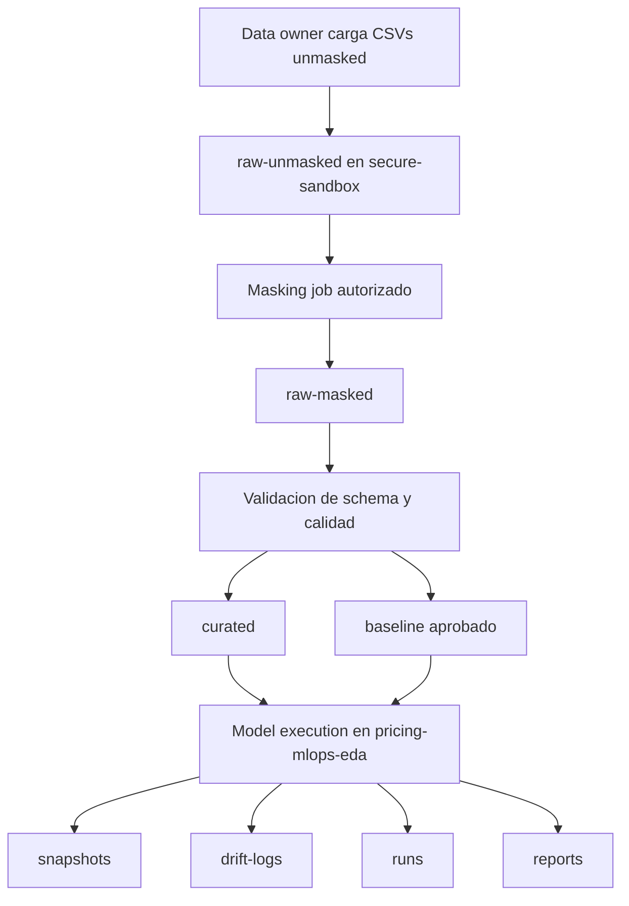

# Data Governance and Security Plan

## Objetivo

Definir donde viven los CSVs unmasked/masked y los artefactos MLOps, quien puede acceder a cada zona, como se transforman los datos y que responsabilidades quedan en `pricing-mlops-platform` y `pricing-mlops-eda`.

Este documento no implementa infraestructura. Es el contrato operativo para una implementacion futura en Storage Account o ADLS Gen2 gobernado por `pricing-mlops-platform`.

## Principios

1. Los CSVs unmasked nunca se commitean en GitHub ni se suben como GitHub Actions artifacts.
2. `raw-unmasked` no se comparte por default y no existe en `staging`.
3. El repo modelo consume datos desde Storage/ADLS con identidad autorizada, no desde Git.
4. `pricing-mlops-platform` gobierna contenedores, RBAC, Key Vault, lifecycle, costos y observabilidad.
5. `pricing-mlops-eda` implementa masking, validaciones, transformaciones, scoring y generacion de artefactos.
6. GitHub Actions usa OIDC/RBAC de minimo privilegio. No debe recibir account keys ni connection strings.
7. El equipo de negocio consume reportes y snapshots aprobados, nunca datos unmasked.

## Resource Groups recomendados

| Scope | Resource Group recomendado | Responsable | Proposito | Unmasked permitido |
|---|---|---|---|---|
| `shared` | `rg-pricing-mlops-platform-shared` | Plataforma | Key Vault, Log Analytics, identidades OIDC, budgets y configuracion comun. | No. |
| `data-lab` o `secure-sandbox` | `rg-pricing-mlops-data-lab` o `rg-pricing-mlops-secure-sandbox` | Plataforma + data owners | Zona cerrada para recibir CSVs unmasked, hacer masking y generar datasets masked iniciales. | Si, con aprobacion explicita. |
| Sandbox personal | `rg-pricing-mlops-sbx-<owner>-<yyyymmdd>` o `rg-pricing-mlops-sbx-david` | Owner del sandbox + plataforma | Experimentos temporales con datos sinteticos o masked; excepciones unmasked solo si el sandbox cumple controles de secure-sandbox. | No por default. |
| `staging` | `rg-pricing-mlops-staging` | Plataforma | Integracion MVP con datos masked, curated y artefactos no sensibles. | No. |
| `validation` | `rg-pricing-mlops-validation` | Plataforma + reviewers | Validacion controlada antes de prod conceptual, con datasets masked/curated aprobados. | No por default; excepcion solo con aprobacion de data owner y controles equivalentes a secure-sandbox. |

`shared` no es un ambiente operativo de datos. Guarda secretos, identidades y logs comunes, pero no CSVs.

## Zonas de datos

| Zona | Sensibilidad | Contenido | Ambientes permitidos | Productor | Consumidor |
|---|---|---|---|---|---|
| `raw-unmasked` | Alta | CSVs originales con identificadores o campos sensibles sin anonimizar. | Solo `data-lab`/`secure-sandbox`; sandbox personal solo por excepcion aprobada. Nunca `staging`. | Data owner o proceso de ingesta controlado. | Proceso de masking autorizado. |
| `raw-masked` | Media | CSVs con IDs hasheados/tokenizados y columnas sensibles removidas o reducidas. | `data-lab`, sandbox personal, `staging`, `validation`. | Proceso de masking. | Repo modelo y validadores. |
| `curated` | Media-baja | Features limpias, tipos normalizados, particiones por fecha/version y datos listos para validacion/scoring. | Sandbox, `staging`, `validation`. | Repo modelo. | Repo modelo, drift, scoring. |
| `baseline` | Media-baja | Distribuciones historicas, percentiles, thresholds, version de baseline y perfiles estadisticos. | Sandbox, `staging`, `validation`. | Repo modelo despues de aprobacion. | Drift engine y validadores. |
| `runs` | Baja-media | `model_run_log`, summaries, estado, commit hash, config version, dataset version y referencias a artefactos. | Sandbox, `staging`, `validation`. | Repo modelo, Function o ADF futuro. | Plataforma, auditoria tecnica, reviewers. |
| `snapshots` | Media | Recomendaciones generadas por `run_id`, preferentemente Parquet/JSONL inmutable. | Sandbox, `staging`, `validation`. | Repo modelo. | BI/downstream autorizado, reviewers, auditoria. |
| `drift-logs` | Baja-media | Resultados PSI, KS, pruebas de proporcion, semaforo y accion recomendada. | Sandbox, `staging`, `validation`. | Repo modelo o Function drift. | Plataforma, negocio, reviewers. |
| `reports` | Baja | Reportes humanos sin datos sensibles directos, agregados y listos para revision. | Sandbox, `staging`, `validation`. | Repo modelo. | Equipo tecnico y negocio. |
| `artifacts` | Variable | Paquetes, manifests, outputs auxiliares, validaciones, graficas y evidencia. No debe incluir unmasked. | Sandbox, `staging`, `validation`. | Repo modelo y CI. | Repo modelo, plataforma, reviewers. |

La implementacion actual de `mlops/configs/storage_layout.json` usa `input` para datasets o samples masked. En el plan futuro, `input` debe mapearse a `raw-masked` o mantenerse como alias no sensible; no debe apuntar a `raw-unmasked`.

## Acceso por actor

| Actor | `raw-unmasked` | `raw-masked` | `curated`/`baseline` | `runs`/`snapshots`/`drift-logs` | `reports` | Comentario |
|---|---|---|---|---|---|---|
| Data owner | Read/write controlado | Read | Read | Read | Read | Aprueba carga, excepciones y retencion. |
| Platform admins | Break-glass o administracion sin inspeccion rutinaria | Admin operacional | Admin operacional | Admin operacional | Admin operacional | Gestionan RBAC, lifecycle y storage; evitan descargar datos sensibles. |
| Secure masking identity | Read | Write | No por default | Write logs minimos | No por default | Identidad dedicada para convertir unmasked a masked. |
| GitHub Actions de plataforma | No | No por default | No por default | Read/write solo para pruebas de contratos si aplica | Read/write no sensible si aplica | Despliega IaC; no procesa datasets unmasked. |
| GitHub Actions de modelo | No | Read en sandbox/staging/validation autorizados | Read/write segun workflow | Write artefactos de corrida | Write reportes | Usa OIDC y RBAC, sin secrets en Git. |
| Desarrolladores del repo modelo | No por default | Read en zonas aprobadas | Read/write en sandbox, read en validation segun rol | Read/write en sandbox, controlado en validation | Read/write no sensible | Trabajan con samples sinteticos o masked. |
| Equipo de negocio | No | No por default | No por default | Read solo agregados aprobados | Read | Consume reportes y snapshots aprobados, no datasets raw. |
| Sistemas downstream | No | No | No por default | Read de snapshots aprobados | Read opcional | Acceso por identidad administrada y rutas publicadas. |

## Reglas por ambiente

### `data-lab` / `secure-sandbox`

- Es el unico ambiente recomendado para recibir CSVs unmasked.
- `raw-unmasked` debe tener acceso explicito por usuario/identidad, sin herencia amplia.
- El proceso de masking lee `raw-unmasked`, consulta salts/secrets en Key Vault y escribe `raw-masked`.
- Las salidas masked deben incluir `dataset_version`, `masking_version`, `schema_version`, `source_file_hash` y fecha de generacion.
- Se debe habilitar retencion corta para unmasked salvo que exista obligacion de conservarlo.

### Sandbox personal

- Usa datos sinteticos, `raw-masked` o `curated`.
- No recibe unmasked por default.
- Si un sandbox personal necesita unmasked, deja de ser sandbox normal y debe cumplir los controles de `secure-sandbox`: RBAC aislado, retencion corta, aprobacion de data owner y auditoria.

### `staging`

- No recibe `raw-unmasked`.
- Puede recibir `raw-masked`, `curated`, `baseline`, `runs`, `snapshots`, `drift-logs`, `reports` y `artifacts`.
- GitHub Actions del repo modelo puede consumir `raw-masked`/`curated` con OIDC y permisos acotados.
- El equipo de negocio solo ve `reports` y snapshots aprobados.

### `validation`

- No recibe unmasked por default.
- Ejecuta quality gates, drift y scoring con datasets masked/curated aprobados.
- Conserva evidencia de corridas con mayor retencion que sandbox.
- Puede usar controles mas estrictos de aprobacion manual antes de sobrescribir baselines.

### `shared`

- Contiene Key Vault, Log Analytics, identidades y budgets.
- No contiene datasets ni artefactos de modelo.
- Key Vault guarda salts, secretos de origen y referencias sensibles; Storage guarda datos.

## Flujo de datos

Pasos operativos:

1. Data owner o proceso controlado carga CSVs unmasked a `raw-unmasked` en `data-lab`/`secure-sandbox`.
2. La carga registra metadata minima: nombre fuente, fecha, owner, checksum/hash, clasificacion y ticket/aprobacion.
3. El proceso de masking obtiene salts/secrets desde Key Vault usando Managed Identity u OIDC.
4. El proceso escribe datasets anonimizados en `raw-masked`; no sobrescribe unmasked.
5. `pricing-mlops-eda` valida schema, nulos criticos, unicidad, monotonicidad y reglas de margen.
6. Las salidas validadas se publican en `curated` con version de dataset y schema.
7. El modelo/scoring lee `curated` y `baseline`, genera recomendaciones y calcula drift.
8. La corrida escribe `runs`, `snapshots`, `drift-logs`, `reports` y `artifacts`.
9. `staging` y `validation` consumen solo `raw-masked`, `curated` y artefactos derivados.

## Controles obligatorios

### No datos en Git

- Repositorios solo contienen codigo, notebooks, contratos, schemas, fixtures sinteticos y documentacion.
- `.gitignore` debe excluir CSVs, Parquet locales, outputs grandes y dumps.
- GitHub artifacts solo pueden contener reportes sin unmasked y artefactos aprobados.
- Pull requests no deben incluir muestras reales ni screenshots con datos sensibles.

### Key Vault

- Salts de hashing, credenciales de fuentes y secretos de integracion viven en Key Vault.
- Los workflows reciben IDs no secretos por environment variables y resuelven secretos por OIDC/RBAC.
- Rotar salts requiere versionar `masking_version` y documentar impacto sobre joins/historial.

### RBAC

- `raw-unmasked`: acceso explicito a data owners y masking identity. Sin acceso amplio a equipo, negocio o GitHub Actions por default.
- `raw-masked` y `curated`: acceso al repo modelo por identidad federada, separado por ambiente.
- `baseline`: escritura restringida; cambios requieren revision porque afectan drift.
- `snapshots` y `reports`: lectura controlada para negocio y sistemas downstream.
- Platform admins administran permisos, pero el acceso de lectura a unmasked debe ser break-glass o justificado.

### Lifecycle y retencion

| Zona | Retencion sugerida PoC | Regla |
|---|---:|---|
| `raw-unmasked` | 7-30 dias | Borrar o archivar cifrado despues de generar masked, salvo obligacion explicita. |
| `raw-masked` | 90 dias | Mantener suficiente para reproducir pruebas recientes. |
| `curated` | 90-180 dias | Retener por version de dataset usada en corridas. |
| `baseline` | Mientras este activo + 180 dias | No borrar baselines usados por corridas auditables. |
| `runs` | 180-365 dias | Mantener metadata de auditoria. |
| `snapshots` | 180-365 dias | Retener recomendaciones por `run_id`; prod futuro puede requerir mas. |
| `drift-logs` | 180-365 dias | Mantener evidencia de semaforo y decisiones. |
| `reports` | 90-180 dias | Retener reportes agregados para negocio. |
| `artifacts` | 30-90 dias | Limpiar artefactos auxiliares no auditables. |

Las reglas exactas deben ajustarse por costo, requisitos academicos/legales y valor de reproducibilidad.

### Costos

- Empezar con Storage/ADLS y lifecycle policies antes de servicios administrados pesados.
- Usar tiers y retencion corta para `raw-unmasked`.
- Evitar duplicar datasets completos entre ambientes; promover solo masked/curated necesarios.
- Registrar `dataset_version` y checksums para evitar copias ambiguas.
- Revisar costos semanalmente durante el PoC y borrar sandboxes expirados.

## Responsabilidades por repo

| Responsabilidad | `pricing-mlops-platform` | `pricing-mlops-eda` |
|---|---|---|
| Definir contenedores y ambientes | Si | Consume definiciones. |
| Crear Storage/ADLS, Key Vault, identidades y RBAC | Si | No. |
| Definir lifecycle/retention | Si | Respeta rutas y metadata. |
| Cargar unmasked | No por default; habilita zona segura | No por default; solo mediante proceso aprobado. |
| Implementar masking | Provee Key Vault/RBAC | Si, como script/job versionado. |
| Validar datos | Define contratos compartidos | Implementa validadores. |
| Ejecutar modelo/scoring | No | Si. |
| Generar snapshots/drift/reports | Observa y audita | Si. |
| Consumir datos desde Git | No | No. |

## Criterios de promocion entre zonas

| De | A | Condiciones |
|---|---|---|
| `raw-unmasked` | `raw-masked` | Masking ejecutado con salt de Key Vault, checksum registrado, columnas sensibles revisadas. |
| `raw-masked` | `curated` | Schema valido, nulos dentro de tolerancia, tipos normalizados, reglas criticas sin falla. |
| `curated` | `baseline` | Aprobacion tecnica, version estable, evidencia de periodo historico y thresholds documentados. |
| `curated` + `baseline` | `snapshots`/`drift-logs` | Corrida con `run_id`, commit hash, config version y dataset version. |
| `snapshots`/`reports` | Consumo negocio | Revision de sensibilidad y agregacion suficiente para no exponer datos raw. |

## Relacion con docs actuales

Este plan extiende `docs/multi-repo-mlops-deployment-plan.md` y `docs/poc-mlops-services-plan.md` con reglas de seguridad mas concretas. No cambia el alcance actual:

- no implementa infraestructura;
- mantiene `prod` como conceptual;
- mantiene `staging` sin unmasked;
- conserva `shared` como scope comun, no como ambiente de datos;
- define `data-lab`/`secure-sandbox` como recomendacion futura, no como Resource Group ya creado;
- mantiene al repo modelo como consumidor de Storage/ADLS y productor de artefactos MLOps.
