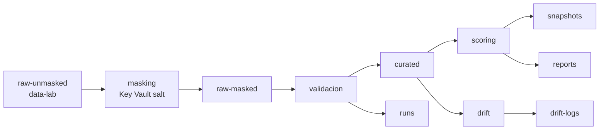

# Data Governance

Reglas para datos, artefactos y acceso en el MVP Pricing MLOps.

## Principios

1. No commitear datos reales ni `raw-unmasked`.
2. `shared` guarda servicios comunes, no datasets.
3. `raw-unmasked` solo vive en `data-lab`/`secure-sandbox`.
4. `sandbox-local`, `staging` y `validation` usan datos masked, curated o sinteticos.
5. El repo `pricing-mlops` consume Storage/ADLS con OIDC/RBAC, no account keys.
6. El equipo de negocio consume reportes o snapshots aprobados, no datasets raw.

## Zonas

| Zona | Contenido | Donde puede vivir | Acceso |
|---|---|---|---|
| `raw-unmasked` | CSVs originales sensibles. | Solo `data-lab`/`secure-sandbox`. | Data owner y masking identity. |
| `raw-masked` / `input` | Datos anonimizados o sinteticos. | Sandbox, staging, validation. | Repo modelo autorizado. |
| `curated` | Features limpias y tipadas. | Sandbox, staging, validation. | Repo modelo. |
| `baseline` | Distribuciones, thresholds y perfiles. | Sandbox, staging, validation. | Lectura para drift, escritura revisada. |
| `runs` | `model_run_log` y summaries. | Sandbox, staging, validation. | Repo modelo escribe; plataforma audita. |
| `snapshots` | Recomendaciones generadas por run. | Sandbox, staging, validation. | Acceso controlado. |
| `drift-logs` | PSI, KS, semaforo y decision. | Sandbox, staging, validation. | Equipo tecnico y negocio autorizado. |
| `reports` | Resumen humano no sensible. | Sandbox, staging, validation. | Equipo tecnico/negocio. |
| `artifacts` | Manifests, evidencia y auxiliares. | Sandbox, staging, validation. | Sin datos unmasked. |

## Flujo

## Acceso

| Actor | Regla |
|---|---|
| Data owner | Aprueba carga y excepciones de datos sensibles. |
| Platform admins | Administran Storage/RBAC/lifecycle; no inspeccionan unmasked salvo break-glass. |
| Masking identity | Lee `raw-unmasked`, escribe `raw-masked`. |
| GitHub Actions plataforma | Despliega IaC; no procesa datasets. |
| GitHub Actions `pricing-mlops` | Lee masked/curated y escribe artefactos. No accede a `raw-unmasked`. |
| Negocio | Lee reportes y outputs aprobados. |

## Retencion PoC

| Zona | Retencion sugerida |
|---|---:|
| `raw-unmasked` | 7-30 dias |
| `raw-masked` | 90 dias |
| `curated` | 90-180 dias |
| `baseline` | Mientras este activo + 180 dias |
| `runs`, `snapshots`, `drift-logs` | 180-365 dias |
| `reports` | 90-180 dias |
| `artifacts` | 30-90 dias |

## Promocion

| De | A | Condicion |
|---|---|---|
| `raw-unmasked` | `raw-masked` | Masking con salt de Key Vault, checksum y version. |
| `raw-masked` | `curated` | Schema, tipos, nulos, unicidad y reglas criticas pasan. |
| `curated` | `baseline` | Revision tecnica y version estable. |
| `curated` + `baseline` | outputs | Corrida con `run_id`, commit, dataset/config/schema/model version. |
| `reports`/snapshots | negocio | Revision de sensibilidad y aprobacion. |

## Prohibiciones

- No subir CSVs/Parquet reales a GitHub.
- No subir `raw-unmasked` como GitHub artifact.
- No usar account keys o connection strings.
- No dar `Owner` o `Contributor` de subscription al repo modelo.
- No exponer `raw-unmasked` en `sandbox-local`, `staging` o `validation`.
- No operar sandboxes personales desde GitHub Actions. Para el modelo, usar `staging` con `MLOPS_ENVIRONMENT=staging` y `MLOPS_RUN_OWNER=<user/team>`.
