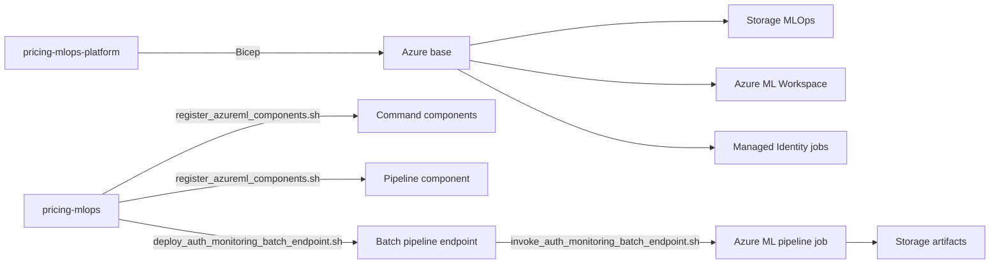

# Flujo End To End

Esta pagina explica como funciona la implementacion actual despues de simplificar ownership entre repos.

## Idea Central

```text
pricing-mlops-platform
-> crea Azure base
-> da permisos al repo modelo
-> no publica componentes ML
-> no despliega el endpoint ML

pricing-mlops
-> registra componentes Azure ML
-> registra el pipeline component
-> actualiza el batch pipeline endpoint
-> invoca smoke tests
-> publica artefactos funcionales en Storage
```

La razon de esta division es evitar doble trabajo. Si el analista o el equipo de modelo cambia la logica derivada del notebook, el mismo repo `pricing-mlops` actualiza componentes, pipeline y endpoint. Platform solo cambia cuando hacen falta recursos Azure o permisos.

## Secuencia De Ejecucion



## Que Vive En Cada Repo

| Responsabilidad | Repo |
|---|---|
| Resource groups, Key Vault, Log Analytics, budget | `pricing-mlops-platform` |
| Storage MLOps y containers | `pricing-mlops-platform` |
| Azure ML Workspace y storage runtime AML | `pricing-mlops-platform` |
| Managed Identity para jobs AML | `pricing-mlops-platform` |
| OIDC/RBAC para repos | `pricing-mlops-platform` |
| Componentes `pricing_mlops_*` | `pricing-mlops` |
| Componente `pricing_mlops_publish_outputs` | `pricing-mlops` |
| Pipeline component `pricing_mlops_auth_monitoring_pipeline` | `pricing-mlops` |
| Endpoint `pricing-auth-monitoring/blue` | `pricing-mlops` |
| Smoke test e invoke del pipeline | `pricing-mlops` |

## Componentes Del Pipeline

La ruta AUTH monitoring no ejecuta el notebook completo dentro de Azure ML. El notebook queda como referencia metodologica; la operacion usa componentes versionables:

```text
validate_prepare
-> build_monitoring_inputs
-> calculate_recommendation_validity
-> calculate_auth_history_drift
-> calculate_operational_decision
-> publish_outputs
```

El ultimo paso, `publish_outputs`, tambien vive en `pricing-mlops`. Publica los artefactos que produjeron los pasos anteriores al layout funcional de Storage.

## Versiones Actuales

| Asset Azure ML | Version |
|---|---|
| `pricing_mlops_publish_outputs` | `0.1.2` |
| `pricing_mlops_auth_monitoring_pipeline` | `0.1.3` |
| `pricing-auth-monitoring/blue` | apunta a `pricing_mlops_auth_monitoring_pipeline:0.1.3` |

El manifest operativo vive en:

```text
pricing-mlops/azureml/manifests/auth-monitoring-release.json
```

## Comandos De Plataforma

Platform solo valida o despliega infraestructura:

```bash
cd pricing-mlops-platform

az bicep build --file infra/foundation/main.bicep
az bicep build --file infra/workloads/pricing-mlops/main.bicep
scripts/what-if.sh staging
scripts/deploy.sh staging
```

## Comandos De Operacion ML

El flujo ML se opera desde `pricing-mlops`:

```bash
cd pricing-mlops

AZURE_SUBSCRIPTION_ID=<subscription-id> \
AZURE_RESOURCE_GROUP=<resource-group> \
AZURE_ML_WORKSPACE=<workspace> \
scripts/register_azureml_components.sh

scripts/deploy_auth_monitoring_batch_endpoint.sh
scripts/invoke_auth_monitoring_batch_endpoint.sh
```

## Donde Ver Resultado

| Evidencia | Ubicacion |
|---|---|
| Estado del job | Azure ML Studio > Jobs |
| Endpoint | Azure ML Studio > Endpoints > Batch endpoints |
| Manifest de version | `pricing-mlops/azureml/manifests/auth-monitoring-release.json` |
| Outputs funcionales | Storage MLOps: `runs`, `snapshots`, `drift-logs`, `reports`, `artifacts` |
| Logs runtime AML | Storage runtime Azure ML del workspace |

## Layout De Artefactos

```text
<container>/environment=<env>/compute=azure-ml/trigger=<trigger>/owner=<owner>/run_date=<yyyymmdd>/run_id=<run_id>/<artifact>
```

Ejemplo de corrida validada:

```text
environment=staging/compute=azure-ml/trigger=batch-endpoint/owner=team46/run_date=20260616/run_id=20260616T085532Z-batch-endpoint/
```

## Regla Para Cambios Futuros

| Cambio | Donde hacerlo |
|---|---|
| Cambia la logica del notebook o del semaforo | `pricing-mlops` |
| Cambia un componente Azure ML | `pricing-mlops` |
| Cambia el pipeline endpoint | `pricing-mlops` |
| Cambia Storage, workspace, identity o RBAC | `pricing-mlops-platform` |
| Cambia documentacion de recursos Azure | `pricing-mlops-platform` |

Si un cambio requiere tocar ambos repos, normalmente significa que se esta cambiando un contrato: nombre de storage, permisos, identidad, contenedores o entradas obligatorias del pipeline.
