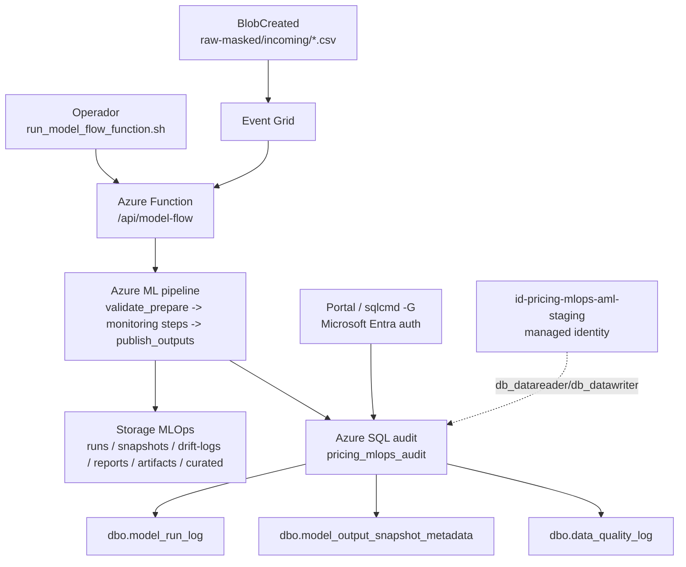

# Azure SQL Audit Runbook

## Recurso

| Campo | Valor |
|---|---|
| SQL server | `sql-pricing-mlops-staging-<suffix>.database.windows.net` |
| Database | `pricing_mlops_audit` |
| Resource group | `rg-pricing-mlops-staging` |
| Region | `centralus` |
| Auth | Microsoft Entra ID |

SQL es metadata-only. Los CSVs, reportes y JSON funcionales siguen en Blob Storage.

## Flujo



## Auth

No usar usuario/password, account keys ni connection strings con secretos.

Local/manual:

```bash
az login
az account set --subscription "<azure-subscription-name>"

sqlcmd \
  -S sql-pricing-mlops-staging-<suffix>.database.windows.net \
  -d pricing_mlops_audit \
  -G
```

Azure ML:

```text
id-pricing-mlops-aml-staging
```

Esa managed identity existe como usuario Entra dentro de la DB y tiene `db_datareader` + `db_datawriter`.

## Portal

1. Azure Portal.
2. Buscar `sql-pricing-mlops-staging-<suffix>`.
3. Abrir `SQL databases`.
4. Abrir `pricing_mlops_audit`.
5. Entrar a `Query editor (preview)`.
6. Login con `Microsoft Entra authentication`.

Si el portal marca firewall:

```text
SQL server -> Networking -> Firewall rules -> Add your client IPv4 address
```

La regla temporal `AllowLocalMigrationClient` se uso para migracion/diagnostico local. Eliminarla cuando ya no haga falta acceso local.

## Tablas

| Tabla | Uso |
|---|---|
| `dbo.model_run_log` | Metadata principal de corrida. |
| `dbo.model_output_snapshot_metadata` | Metadata del snapshot publicado. |
| `dbo.data_quality_log` | Reservada para checks de calidad por run. |

## Queries

Ultimas corridas:

```sql
select top 20
  run_id,
  environment,
  status,
  row_count,
  drift_status,
  trigger_type,
  model_ref,
  model_commit_sha,
  started_at_utc,
  finished_at_utc
from dbo.model_run_log
order by started_at_utc desc;
```

Detalle de un run:

```sql
select *
from dbo.model_run_log
where run_id = '20260525T021122Z-function';

select *
from dbo.model_output_snapshot_metadata
where run_id = '20260525T021122Z-function';
```

Corridas fallidas:

```sql
select
  run_id,
  environment,
  status,
  trigger_type,
  input_blob_path,
  artifact_manifest_uri,
  started_at_utc,
  finished_at_utc
from dbo.model_run_log
where status <> 'succeeded'
order by started_at_utc desc;
```

Drift por semaforo:

```sql
select
  drift_status,
  count(*) as runs
from dbo.model_run_log
group by drift_status
order by runs desc;
```

Runs por trigger:

```sql
select
  trigger_type,
  count(*) as runs,
  max(started_at_utc) as last_run
from dbo.model_run_log
group by trigger_type;
```

Snapshots publicados:

```sql
select top 20
  run_id,
  environment,
  row_count,
  drift_status,
  output_schema_version,
  snapshot_uri,
  created_at_utc
from dbo.model_output_snapshot_metadata
order by created_at_utc desc;
```

Source del modelo:

```sql
select top 20
  run_id,
  model_repo,
  model_ref,
  model_commit_sha
from dbo.model_run_log
order by started_at_utc desc;
```

Conteos rapidos:

```sql
select count(*) as model_run_log_rows
from dbo.model_run_log;

select count(*) as snapshot_metadata_rows
from dbo.model_output_snapshot_metadata;

select count(*) as data_quality_rows
from dbo.data_quality_log;
```

## Migraciones

Aplicar schema y usuarios Entra:

```bash
MLOPS_SQL_SERVER=sql-pricing-mlops-staging-<suffix>.database.windows.net \
MLOPS_SQL_DATABASE=pricing_mlops_audit \
mlops/scripts/apply_sql_audit_schema.sh staging
```

Requiere `sqlcmd` con soporte Entra auth.
