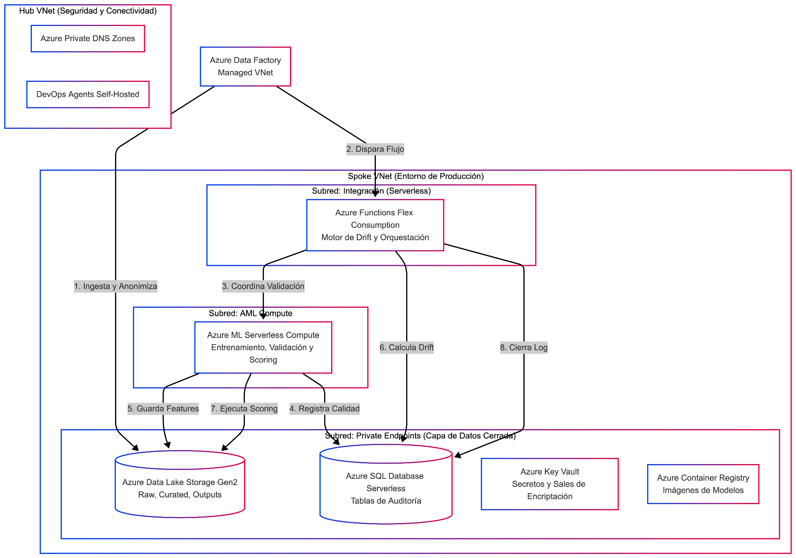
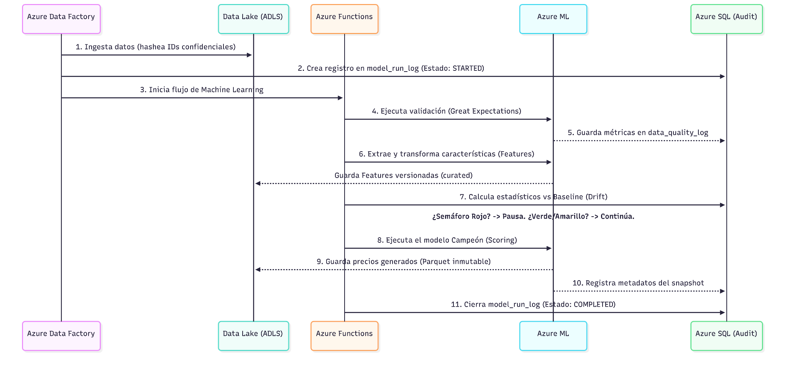

# Documento de Diseno Tecnico: Plataforma MLOps para Pricing Intelligence

> Referencia original extraida del PDF `Diseno Tecnico_ Arquitectura MLOps.pdf`.
>
> Este documento debe conservarse como el plan original. No debe sobrescribirse para reflejar cambios posteriores. Si se decide cambiar la arquitectura o el alcance, crear otro documento con el estado final y mantener este archivo como referencia historica.

| Campo | Valor |
|---|---|
| Status | En proceso de revision |
| Equipo | Emanuel Flores Martinez, Mario Javier Soriano Aguilera, David Alberto Serrano Garcia |
| Fecha de creacion | 3 may 2026 |
| Fecha de actualizacion | 3 may 2026 |
| Acceso | Confidencial |

## 1. Contexto de Negocio y Objetivos del Proyecto

La organizacion depende del sistema de Pricing Business Intelligence para sugerir precios objetivos (Target), minimos (Floor) y de inicio (Start) a nivel de Numero de Parte (KPN) y Segmento de Distribuidor.

Actualmente, los modelos analiticos son precisos, pero el entorno comercial cambia rapidamente. El objetivo de este proyecto es construir una capa de MLOps que actue como un "freno de emergencia y auditor" automatizado.

Esta infraestructura garantizara que las recomendaciones de precios sean reproducibles, auditables y se ajusten proactivamente a la volatilidad del mercado, protegiendo los margenes comerciales y el revenue sin generar costos excesivos de infraestructura en la nube.

## 2. Alineacion entre Arquitectura Tecnica y Valor de Negocio

La arquitectura propuesta se basa en decisiones tecnicas especificas que resuelven directamente las preocupaciones de los stakeholders:

- **Modelo de Costos "Serverless" (Pago por Uso):** El negocio requiere eficiencia. En lugar de tener servidores costosos encendidos 24/7, utilizamos Azure Functions (Flex Consumption) y Azure SQL Serverless. El sistema solo consume presupuesto durante los minutos exactos en que calcula precios o evalua desviaciones, logrando una reduccion drastica del costo operativo mensual.
- **Seguridad Nivel Enterprise:** Los datos de margenes y costos son altamente confidenciales. Todo el trafico de datos se aisla mediante VNet y Private Endpoints. Ningun componente tiene salida a internet publico.
- **Decisiones Ponderadas por Impacto Financiero:** El mecanismo de "Drift" (desviacion de datos) no trata todos los productos igual. Una desviacion en un producto de bajo volumen no detendra la operacion, pero una anomalia en un Segmento de Distribuidor clave (Disty Segment) activara una alerta critica (Semaforo Rojo).
- **Trazabilidad Absoluta:** Para auditoria, el sistema registra la "Espina Dorsal" de cada ejecucion en tablas SQL temporales. Podemos demostrar con evidencia irrefutable que version de codigo, que datos y que configuracion generaron un precio especifico hace seis meses.

## 3. Arquitectura de Servicios y Topologia en Azure

El siguiente diagrama detalla la topologia de red aislada (Hub-and-Spoke) y los servicios serverless utilizados para garantizar seguridad y bajo costo operativo.

### Topologia de Red (Hub-and-Spoke) y Flujo de Conectividad

La arquitectura utiliza un modelo Hub-and-Spoke. El Hub VNet contiene los componentes de seguridad (Azure Private DNS Zones) y de despliegue (DevOps Agents Self-Hosted), y se conecta al Spoke VNet (Entorno de Produccion) mediante VNet Peering.

El Spoke VNet se divide en:

- **Subred: Integracion (Serverless):** Aloja Azure Functions Flex Consumption (Motor de Drift y Orquestacion).
- **Subred: AML Compute:** Aloja Azure ML Serverless Compute (Entrenamiento, Validacion y Scoring).
- **Subred: Private Endpoints (Capa de Datos Cerrada):** Aloja Azure Data Lake Storage Gen2 (ADLS), Azure SQL Database Serverless (Tablas de Auditoria), Azure Key Vault y Azure Container Registry (ACR).

Los flujos principales son orquestados por Azure Data Factory (ADF), que inicia la ingesta y dispara el flujo hacia Azure Functions (AF) para la coordinacion de la validacion y el scoring.

### 3.1 Diccionario de Servicios y Responsabilidades

| Componente Azure | Responsabilidad en el Proyecto MLOps |
|---|---|
| Azure Data Factory (ADF) | Orquestador principal. Se encarga de la ingesta de datos desde los sistemas fuente, aplica el enmascaramiento/anonimizacion de IDs de clientes y programa las ejecuciones diarias/semanales. |
| Azure Data Lake Storage (ADLS) | Almacenamiento inmutable y versionado. Guarda los datos crudos (raw), las caracteristicas procesadas (curated) y los resultados finales de precios (model_output_snapshot). |
| Azure Functions (Flex) | Cerebro de las reglas de negocio. Calcula metricas estadisticas (PSI, KS), determina el estado del Semaforo y registra los eventos en la base de datos. |
| Azure Machine Learning (AML) | Motor de ejecucion ML. Aloja el registro de modelos, ejecuta la validacion de calidad de datos con Great Expectations y corre el modelo base. |
| Azure SQL (Serverless) | La "Espina Dorsal" de auditoria. Almacena las tablas temporales de `model_run_log`, el historial de Drift y los metadatos de los snapshots. |
| Azure Key Vault | Boveda de seguridad. Almacena las llaves criptograficas utilizadas para anonimizar los datos confidenciales antes de que toquen el Data Lake. |

## 4. Flujo del Proceso Completo (Sequence Flow)

Este flujo de secuencia ilustra el paso a paso de una ejecucion diaria del sistema de Pricing, mostrando como interactuan los componentes tecnicos y donde actuan las compuertas de calidad.

1. ADF ingesta datos y hashea IDs confidenciales, enviandolos a ADLS.
2. ADF crea un registro en `model_run_log` en SQL (Estado: `STARTED`).
3. ADF inicia el flujo de Machine Learning en Azure Functions (AF).
4. AF ordena a AML ejecutar la validacion (Great Expectations).
5. AML guarda las metricas de calidad en `data_quality_log` en SQL.
6. AF ordena a AML extraer y transformar caracteristicas (Features).
7. AML guarda Features versionadas (curated) en ADLS.
8. AF calcula estadisticos vs Baseline (Drift) en SQL.
9. El sistema evalua si se activa el Semaforo Rojo; si es asi, pausa la operacion. Si es Verde/Amarillo, continua.
10. AF ordena a AML ejecutar el modelo Campeon (Scoring).
11. AML guarda los precios generados (Parquet inmutable) en ADLS.
12. AML registra metadatos del snapshot en SQL.
13. AF cierra el `model_run_log` en SQL (Estado: `COMPLETED`).

## 5. Enfoque Paso a Paso y Cronograma (Roadmap)

Para garantizar un despliegue seguro, el equipo de ingenieria ejecutara el proyecto en cuatro fases secuenciales.

### Roadmap de Implementacion MLOps

| Fase | Nombre | Alcance |
|---|---|---|
| Fase 1 | Cimientos | Topologia VNet Hub-Spoke & Private Links. Configuracion Key Vault & Identidades (UAMIs). |
| Fase 2 | Auditoria | Despliegue Azure SQL Serverless. Creacion de esquemas (`model_run_log`, snapshots). |
| Fase 3 | Calidad & Drift | Integracion Great Expectations en AML. Desarrollo de logica de Drift en Azure Functions. |
| Fase 4 | Orquestacion | Pipelines ADF & CI/CD con Terraform/Bicep. Pruebas E2E, datos sinteticos & cierre. |

## 6. Validacion, Calidad del Trabajo y Experiencia del Desarrollador

No probaremos codigo en produccion. La calidad tecnica se asegura mediante:

- **Datos Sinteticos para Desarrollo:** Los ingenieros trabajaran con un conjunto de datos simulado (generado a partir de distribuciones reales) en sus entornos locales. Los datos confidenciales de precios nunca salen del entorno de produccion.
- **Integracion Continua (CI):** Cada cambio en el codigo o en la infraestructura debe pasar pruebas automaticas en menos de 60 segundos antes de ser fusionado.
- **Validacion de Datos (Great Expectations):** Antes de que el modelo calcule un solo precio, un contenedor evalua el dataset contra reglas contractuales. Si los datos de entrada vienen corruptos desde el origen, el proceso se aborta automaticamente (Quality Gate).

## 7. Gestion de Riesgos: Mecanismo de Rollback

Si una nueva version del modelo es promovida a produccion pero el negocio detecta un comportamiento erratico en los precios:

1. **Sin perdida de historial:** El sistema detiene la generacion de precios automaticamente o via intervencion manual.
2. **Reversion en < 15 minutos:** Se reasigna la etiqueta de "Produccion" a la version anterior del modelo (el ultimo "campeon" estable) en el registro de Azure ML, sin alterar codigo.
3. **Correccion Transparente:** Los precios erroneos no se borran (para fines de auditoria), pero se marcan como "sustituidos" (superseded) en Azure SQL. El sistema recalcula los precios con el modelo seguro y los publica.

## 8. Proximos Pasos: Definicion de Umbrales del Semaforo

Para calibrar el sistema, el equipo de Datos y Pricing tiene el siguiente plan de accion:

1. El equipo de datos correra el algoritmo sobre los ultimos 6 meses de datos historicos de ventas.
2. Identificaremos los umbrales estadisticos exactos (PSI, KS) donde historicamente ocurrieron anomalias de negocio, por ejemplo compresion de margenes.
3. Presentaremos una propuesta concreta a los lideres de negocio: "Si la volatilidad supera el X%, sugerimos detener el modelo (Rojo)". Los stakeholders revisaran y aprobaran estos limites de tolerancia al riesgo.

## 9. Anexo: Especificaciones de Implementacion sobre Datos Reales

Tras el perfilado de los esquemas de produccion (`masked_input_dataset.csv` con ~234k filas y `masked_output_recommendations.csv` con ~8.3k filas), se establecen las siguientes reglas exactas de implementacion para las capas de calidad de datos, computo y deteccion de anomalias.

### 9.1 Dimensionamiento de Computo (Validacion Serverless)

- **Consumo de Memoria:** Mediante el uso de tipos de datos optimizados y lecturas proyectadas en PyArrow (leyendo archivos Parquet directamente de ADLS), el dataset completo de entrada ocupa ~7 MB en memoria.
- **Decision Arquitectonica:** Esto valida definitivamente el uso de Azure Functions (Flex Consumption). El procesamiento de Drift completo tomara menos de 30 segundos, muy por debajo de los limites del servicio, sin requerir particionado complejo (`chunking`) ni clusteres dedicados.

### 9.2 Compuertas de Calidad Criticas (Great Expectations)

El paso de validacion (`model_inputs.json` y `curated_features.json`) no detendra el flujo por anomalias esperadas, pero actuara como un freno de emergencia ante corrupciones criticas.

Las 4 reglas iniciales son:

1. **Tolerancia Inteligente a Nulos (Costos):** La columna `current_cost_orders` tiene un 49% de nulos de forma natural. Regla: alerta informativa (Warning) si la integridad baja al 45%. Falla Critica (detiene el pipeline) solo si la integridad cae por debajo del 30%, indicando una falla en el pipeline de origen.
2. **Contrato de Granularidad Unica:** La combinacion de llaves `[kpn, vpareadescription, distysegment]` debe ser 100% unica en el dataset de salida para evitar duplicacion de proyecciones de revenue en sistemas downstream.
3. **Invarianza de Monotonicidad (Percentiles):** El modelo matematicamente siempre debe cumplir que `P0_PRICE <= P20_PRICE <= P50_PRICE <= P85_PRICE <= P100_PRICE`. Cualquier violacion a esta regla indica una falla interna del algoritmo.
4. **Consistencia del Piso de Margen (Business Rule):** Si la bandera `P20_Was_Adjusted` es verdadera, el precio ajustado debe ser estrictamente mayor o igual a `Min_P20_for_5pct_margin`. Esta regla garantiza que el modelo no venda por debajo del margen del 5% permitido.

### 9.3 Configuracion del Semaforo de Desviacion (Drift)

Ademas de detectar cambios en la distribucion de datos mediante metodos estadisticos PSI y Kolmogorov-Smirnov, el motor de Drift monitoreara "Senales de Negocio", que son indicadores tempranos de compresion de margenes o perdida de precision.

| Metrica / Columna | Metodo Estadistico | Umbral (Amarillo / Rojo) | Justificacion de Negocio |
|---|---|---|---|
| `rslpriceusd` y `quantity` | PSI (Indice de Estabilidad) en contenedores logaritmicos | 0.10 / 0.25 | Detecta cambios masivos en el volumen de ventas o rangos de precio de reventa. |
| `elasticity_mean` | KS (Kolmogorov-Smirnov) | 0.05 / 0.15 | Alerta si cambia el comportamiento elastico del mercado; captura mejor las colas de la distribucion. |
| Compresion del Spread (`P85 - P20`) | KS sobre la diferencia | 0.10 / 0.20 | Si el rango de precios sugeridos se comprime abruptamente, indica perdida de sensibilidad del modelo. |
| Tasa de `P20_Was_Adjusted` | Prueba Z de proporciones (Control Chart) | z > 2.0 / z > 3.5 | Metrica critica: historicamente, solo el 0.31% de las recomendaciones tocan el piso del 5% de margen. Si esta tasa sube, significa que los costos estan superando los precios de mercado. |

### 9.4 Resiliencia ante Evolucion de Esquemas

Cuando el negocio agregue nuevos niveles de jerarquia, por ejemplo `hier_level7`, o elimine costos redundantes, el sistema esta disenado para no romperse:

1. **Tablas de Auditoria Inmutables:** El esquema SQL `model_output_snapshot_metadata` registra la version del contrato de datos (`output_schema_version`). Las adiciones son retrocompatibles.
2. **Versionado de Baselines:** Un cambio de columnas forzara la creacion de un nuevo identificador de linea base historica, por ejemplo `baseline_2026Q3_v3.1`. Durante la transicion, el motor de Drift comparara exclusivamente la interseccion de columnas conocidas hasta reunir suficiente historial de la nueva variable.
