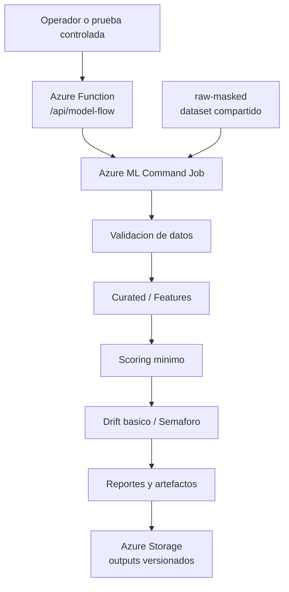

# Reporte de Avance - Plataforma MLOps para Pricing Intelligence

**Proyecto:** Plataforma MLOps para Pricing Intelligence
**Equipo:** Team 46
**Materia:** Proyecto Integrador de Maestria
**Fecha:** 22 de mayo de 2026
**Repositorios relacionados:** `pricing-mlops-platform`, `pricing-mlops`, `pricing-mlops-eda`

## 1. Resumen Ejecutivo

Durante esta etapa se construyo un MVP funcional de una plataforma MLOps para Pricing Intelligence en Azure. Este avance no reemplaza el proyecto original; representa una primera base operativa para avanzar hacia la arquitectura completa planteada en el diseno tecnico.

El avance principal fue pasar de una idea arquitectonica documentada a un flujo minimo ejecutable en la nube con datos masked/sinteticos, evidencia versionada y separacion clara entre infraestructura, orquestacion y ejecucion del flujo ML.

El flujo actual queda alineado con el diseno objetivo principal:

```text
Azure Function -> Azure ML Job -> Azure Storage
```

Azure Functions funciona como orquestador ligero. Azure Machine Learning ejecuta el proceso tecnico del flujo. Azure Storage conserva los datos de entrada masked y los artefactos de salida. GitHub Actions ya no se considera el motor operativo del flujo ML; queda limitado a validacion, despliegue controlado y tareas de CI/CD.

Es importante aclarar que el MVP todavia no contiene un modelo productivo real ni un ciclo completo de entrenamiento. En esta etapa se implemento un flujo controlado que valida datos, genera una capa curated, ejecuta scoring minimo, calcula drift basico y publica reportes. Esta base permite integrar posteriormente un modelo real, ya sea propio o entregado por un tercero, y continuar hacia la meta original del proyecto.

## 2. Objetivo Del Proyecto

El objetivo general del proyecto sigue siendo disenar e implementar una plataforma MLOps para soportar un caso de Pricing Intelligence. La plataforma final debe permitir operar datos, modelos, ejecuciones, validaciones, reportes y evidencia de forma trazable, repetible y segura.

Los objetivos especificos cubiertos en esta etapa de avance son:

- Separar infraestructura, codigo funcional y documentacion historica.
- Crear una base de infraestructura Azure reproducible con Bicep.
- Ejecutar un flujo minimo end-to-end en Azure usando datos masked.
- Publicar outputs versionados en Storage.
- Evitar el uso de datos unmasked en ambientes operativos.
- Reducir dependencia operativa de GitHub Actions.
- Mantener costos bajos y evitar servicios fuera del alcance del MVP.

## 3. Relacion Con El Diseno Tecnico Original

El diseno tecnico original planteaba una arquitectura MLOps con servicios como Azure Functions, Azure Machine Learning, almacenamiento de datos, monitoreo y componentes futuros como ADF, SQL y redes privadas.

El avance actual implementa una version acotada y de bajo costo de esa arquitectura. Esta version no pretende cerrar todo el alcance original. Su funcion es validar los componentes base que permiten continuar hacia la arquitectura completa de forma controlada.

| Elemento del diseno original | Estado actual |
|---|---|
| Azure Functions como orquestador | Implementado como entrada operativa del flujo. |
| Azure Machine Learning como compute ML | Implementado con Azure ML command jobs. |
| Storage/ADLS para inputs y outputs | Implementado con contenedores para raw masked, curated, runs, snapshots, drift logs, reports y artifacts. |
| GitHub Actions | Usado para CI/CD y pruebas controladas, no como compute ML operativo. |
| Azure SQL | Pospuesto. No es necesario para el MVP actual. |
| Azure Data Factory | Pospuesto. La orquestacion inicial se resolvio con Azure Functions. |
| Private Endpoints / Hub-Spoke | Pospuesto por costo y complejidad. |
| Produccion | Fuera de alcance. No existe IaC ni parameters de prod. |

Por lo tanto, la meta original se mantiene. Lo que cambio fue el orden de implementacion: primero se valido el flujo minimo con Azure Function, Azure ML y Storage; despues se podran incorporar las piezas faltantes segun madurez, necesidad y presupuesto.

## 4. Arquitectura Implementada

La arquitectura actual tiene tres responsabilidades principales:

- **Orquestacion:** Azure Function recibe la solicitud, valida parametros y somete un job de Azure ML.
- **Compute ML:** Azure ML ejecuta el flujo funcional de datos y modelo.
- **Persistencia:** Azure Storage guarda inputs y outputs versionados.



El endpoint principal es una Azure Function. Detras de ese endpoint no se ejecuta el modelo directamente. La Function solo orquesta: recibe parametros, genera el contexto de ejecucion y manda a Azure ML a correr el flujo.

## 5. Servicios Azure Desplegados

Los recursos activos principales se encuentran en el ambiente `staging`.

| Servicio | Recurso | Rol |
|---|---|---|
| Resource Group | `rg-pricing-mlops-staging` | Contenedor logico del MVP operativo. |
| Azure Storage | `<mlops-storage-account>` | Data lake operativo para inputs masked y outputs. |
| Azure ML runtime storage | `stamlpmlopsstg<suffix>` | Storage operativo separado para artifacts internos de Azure ML en una migracion de workspace futura. |
| Azure Machine Learning | `mlw-pricing-mlops-staging-<suffix>` | Workspace donde se ejecutan los command jobs. |
| Azure Function App | `func-pricing-mlops-staging-<suffix>` | Orquestador ligero del flujo. |
| App Service Plan | `asp-pricing-mlops-staging` | Plan Consumption para la Function. |
| Function host storage | `stfn<generated-suffix>` | Storage tecnico requerido por Azure Functions. |
| Application Insights | `appi-pricing-mlops-staging-<suffix>` | Observabilidad de la Function y servicios asociados. |
| Managed Identity | `id-pricing-mlops-aml-staging` | Identidad para ejecucion segura en Azure ML. |
| ACR asociado a AML | Administrado por Azure ML | Runtime interno de Azure ML, no ruta activa de Container Apps. |

Tambien se eliminaron recursos legacy del PoC anterior con Container Apps y ACR dedicado, porque ya no formaban parte de la ruta activa del diseno.

El Storage MLOps principal se documento como data lake funcional. El Storage runtime de Azure ML ya existe por IaC, pero el workspace actual conserva su storage asociado original; una separacion completa de artifacts internos requiere crear un workspace nuevo apuntando al runtime storage y validar el flujo antes de limpiar containers legacy.

## 6. Estructura De Repositorios

El proyecto se organiza en tres repositorios:

| Repositorio | Responsabilidad |
|---|---|
| `pricing-mlops-platform` | Infraestructura Azure, IaC, RBAC/OIDC, Storage, Azure ML, Azure Functions y documentacion operativa. |
| `pricing-mlops` | Codigo funcional del flujo: validacion, curated, scoring minimo, drift, reportes y scripts operativos. |
| `pricing-mlops-eda` | Referencia historica y analisis exploratorio. No es el repositorio operativo actual. |

Esta separacion permite que la plataforma gobierne recursos cloud y que el repositorio funcional evolucione el flujo del modelo sin mezclarlo con IaC.

## 7. Configuracion IaC

La infraestructura se definio con Bicep y quedo separada en capas:

```text
infra/
  foundation/
    main.bicep
    modules/
  workloads/
    pricing-mlops/
      main.bicep
      modules/
  parameters/
    staging.bicepparam
    validation.bicepparam
    data-lab.bicepparam
    sandbox-local.bicepparam
```

La capa `foundation` contiene recursos base de plataforma, como resource groups, identidades, RBAC y servicios compartidos. La capa `workloads/pricing-mlops` contiene recursos especificos del caso Pricing MLOps, como Storage, Azure ML y Azure Functions.

Los ambientes definidos son:

| Ambiente o scope | Uso |
|---|---|
| `shared` | Servicios compartidos. No es ambiente operativo de MLOps. |
| `staging` | Ambiente principal del MVP operativo. |
| `validation` | Ambiente no productivo preparado para validacion controlada futura. |
| `data-lab` | Scope restringido para tratamiento futuro de datos unmasked/masking. |
| `sandbox-local` | Sandbox local/admin, no operado desde GitHub Actions. |
| `prod` | Solo concepto futuro. No existe implementacion real. |

## 8. Flujo Operativo Actual

El flujo operativo actual se ejecuta de la siguiente manera:

1. Un operador o script llama a la Azure Function `POST /api/model-flow`.
2. La Function valida el ambiente, owner e input.
3. La Function somete un Azure ML command job.
4. Azure ML lee el dataset masked desde `raw-masked`.
5. El flujo funcional valida datos y genera una version curated.
6. Se ejecuta scoring minimo/controlado.
7. Se calcula drift basico y se genera un semaforo inicial.
8. Se producen logs, snapshots, reportes y artefactos.
9. Los outputs se publican en Azure Storage con rutas versionadas.

El input compartido actual es:

```text
raw-masked/samples/sample_pricing_v1.csv
```

Los outputs quedan particionados con esta forma:

```text
environment=staging/compute=azure-ml/owner=team46/run_date=<yyyymmdd>/run_id=<run_id>/
```

## 9. Evidencia De Ejecucion

Se logro ejecutar el flujo end-to-end en Azure sin usar GitHub Actions como compute operativo.

Ejecucion validada:

```text
Azure ML job: dreamy_vase_3dkv4c7m1f
Run id: 20260518T040339Z-function
```

Outputs verificados:

```text
runs/.../model_run_log.json
snapshots/.../model_output_snapshot.csv
drift-logs/.../model_drift_log.json
reports/.../report.md
artifacts/.../curated_pricing.csv
curated/.../curated_pricing.csv
```

Esto demuestra que la Function puede iniciar el job, que Azure ML ejecuta el flujo y que Storage conserva la evidencia versionada.

## 10. Estado Del Modelo

Actualmente no existe un modelo productivo real versionado dentro del MVP. Tampoco existe todavia un ciclo formal de entrenamiento, registro, promocion y rollback de modelos.

Lo que existe es una base operativa para integrar un modelo:

- Validacion de entrada.
- Preparacion de datos curated.
- Scoring minimo/controlado.
- Drift basico.
- Reporte de ejecucion.
- Publicacion de outputs.

Esto es intencional. El objetivo de esta etapa fue validar la plataforma y el flujo MLOps, no entrenar un modelo definitivo. Si un tercero entrega el modelo, este puede integrarse posteriormente como paquete, API, artefacto registrado o adaptador, manteniendo el mismo contrato operativo.

## 11. Seguridad Y Gobierno De Datos

Se aplicaron decisiones de seguridad y gobierno de datos acordes al alcance del MVP:

- No se usan datos unmasked en `staging`.
- No existe `raw-unmasked` en el ambiente operativo.
- No se versionan secretos.
- No se usan account keys ni connection strings para los datos MLOps.
- Se usa identidad administrada y RBAC para acceso a Azure.
- La Function valida ambientes permitidos y parametros de entrada.
- GitHub Actions no ejecuta el flujo ML operativo.

Pendiente de seguridad:

- El endpoint de la Function todavia usa Function key como control temporal.
- Una siguiente iteracion debe evaluar Entra ID/Easy Auth o API Management si el proyecto requiere mayor control de autenticacion.

## 12. Control De Costos Y Limpieza

El MVP se mantuvo con servicios de bajo costo y evitando recursos innecesarios:

- Azure Function en plan Consumption.
- Azure ML command jobs bajo demanda.
- Sin GPU.
- Sin endpoints online de Azure ML.
- Sin ADF.
- Sin SQL.
- Sin Private Endpoints.
- Sin Hub-Spoke.
- Sin produccion.

Tambien se limpiaron recursos legacy del PoC anterior basado en Container Apps, ya que la direccion tecnica final del MVP se movio a Azure Functions + Azure ML.

## 13. Validaciones Realizadas

Se realizaron validaciones locales y de infraestructura:

```bash
scripts/validate-mlops-contracts.py
az bicep build --file infra/foundation/main.bicep
az bicep build --file infra/workloads/pricing-mlops/main.bicep
az bicep build-params --file infra/parameters/staging.bicepparam
az bicep build-params --file infra/parameters/validation.bicepparam
az bicep build-params --file infra/parameters/data-lab.bicepparam
az bicep build-params --file infra/parameters/sandbox-local.bicepparam
scripts/what-if.sh staging
```

En el repositorio funcional tambien se validaron compilacion, pruebas unitarias, validacion de inputs y ejecucion local del flujo.

## 14. Cambios Respecto Al Plan Inicial

El plan original sigue siendo la referencia principal del proyecto. El MVP implementado hasta esta etapa cubre solo una parte del alcance. Durante el avance se hicieron ajustes pragmaticos para construir primero una base funcional, medible y de bajo costo:

| Tema | Plan original | Estado actual |
|---|---|---|
| Orquestacion | Azure Functions | Se mantiene. |
| Compute ML | Azure ML | Se mantiene. |
| GitHub Actions | Automatizacion y despliegue | Se limito a CI/CD; no opera el ML. |
| Container Apps | Evaluado como PoC | Retirado de la ruta activa. |
| ADF | Posible orquestador futuro | Pospuesto. |
| SQL | Persistencia analitica futura | Pospuesto. |
| Modelo real | No disponible completamente | Pendiente de integracion. |
| Seguridad avanzada | Red privada/API Management | Pospuesta por costo y alcance. |

El cambio mas importante fue descartar Container Apps como ruta activa y regresar al patron del diseno original: Azure Function como orquestador y Azure ML como compute principal. Esto acerca el MVP al diseno original, aunque todavia faltan componentes de madurez empresarial.

## 15. Avance Contra La Meta Original

El avance actual se puede entender como una primera etapa dentro de la ruta hacia el proyecto completo.

| Area | Meta original | Avance actual | Estado |
|---|---|---|---|
| Ingestion de datos | Recibir datos para pricing desde fuentes controladas. | Dataset masked compartido en Storage. | Parcial |
| Gobierno de datos | Separar datos masked/unmasked y controlar accesos. | `staging` usa masked; `data-lab` queda preparado para unmasked restringido. | Parcial |
| Orquestacion | Azure Functions como disparador del flujo. | Function operativa que inicia Azure ML jobs. | Cubierto para MVP |
| Compute ML | Azure ML para ejecutar procesos de modelo. | Azure ML command job ejecuta el flujo minimo. | Cubierto para MVP |
| Modelo de pricing | Modelo real entrenado o integrado. | Scoring minimo/controlado; modelo real pendiente. | Pendiente |
| Drift y monitoreo | Drift y semaforos robustos. | Drift basico y evidencia versionada. | Parcial |
| Persistencia analitica | Posible SQL/curated para consumo posterior. | Outputs versionados en Storage. | Parcial |
| Seguridad avanzada | Autenticacion robusta, red privada y gobierno completo. | RBAC/Managed Identity; Function key temporal. | Parcial |
| Produccion | Ambiente productivo gobernado. | No implementado. | Pendiente |

## 16. Riesgos Y Pendientes

Los principales pendientes son:

- Integrar un modelo real o definir un baseline propio.
- Definir si el modelo sera entregado como paquete, API, artefacto de Azure ML o adaptador.
- Implementar drift estadistico mas robusto, por ejemplo PSI, KS o pruebas por segmento.
- Formalizar registro de modelos, versionamiento, promocion y rollback.
- Fortalecer autenticacion del endpoint de Function con Entra ID o API Management.
- Limpiar o archivar particiones historicas de Storage generadas por PoCs anteriores, por ejemplo `compute=container-job` o rutas antiguas sin `compute=azure-ml`.
- Decidir si se crea un workspace Azure ML nuevo para que los artifacts internos de Azure ML usen el Storage runtime separado.
- Evaluar ADF si el flujo crece a multiples fuentes y programaciones.
- Evaluar Azure SQL solo si se requiere consulta estructurada o consumo por dashboards.
- Definir estrategia de monitoreo y alertamiento para ejecuciones fallidas.

## 17. Proximos Pasos Recomendados

Para la siguiente etapa se recomienda:

1. Definir el contrato de entrada del modelo real.
2. Crear un adaptador para integrar el modelo sin exponer su implementacion interna.
3. Reemplazar el scoring minimo por scoring real o baseline formal.
4. Agregar metricas de drift y calidad mas cercanas al caso de negocio.
5. Mejorar seguridad del endpoint con Entra ID.
6. Normalizar Storage para que los reportes activos usen solo `compute=azure-ml` y dejar los outputs legacy como historicos o eliminarlos con aprobacion.
7. Agregar dashboard operativo simple para ejecuciones y resultados.
8. Preparar ambiente `validation` para pruebas controladas antes de una futura promocion.

## 18. Conclusion

El proyecto avanzo de una arquitectura conceptual a un MVP funcional desplegado en Azure. La plataforma ya cuenta con infraestructura reproducible, separacion clara entre repositorios, orquestacion con Azure Functions, ejecucion con Azure ML y almacenamiento versionado de evidencia.

El resultado actual no debe interpretarse como el proyecto final ni como un modelo productivo terminado. Debe interpretarse como la primera base MLOps operativa que permite avanzar hacia el diseno original con menor riesgo tecnico. La meta original se mantiene: construir una plataforma mas completa para Pricing Intelligence, incorporando modelo real, monitoreo mas robusto, componentes analiticos y controles de seguridad adicionales conforme el proyecto madure.
