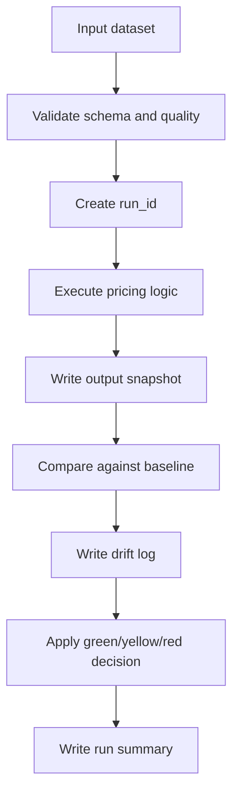
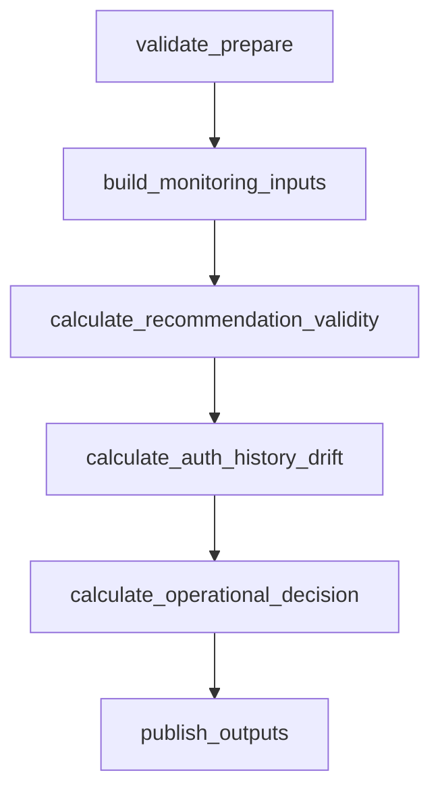

# MLOps Flow

Este flujo define la operacion base del sistema de pricing. No intenta automatizar retraining ni crear una plataforma de ML completa.

## Objetivo

Responder de forma trazable:

- que version de codigo genero una corrida;
- que configuracion y dataset se usaron;
- que outputs se generaron;
- si hubo drift relevante;
- si el estado es green, yellow o red.

## Flujo minimo

## Controles

| Paso | Control minimo |
|---|---|
| Input | Usar datos anonimizados, agregados o sinteticos en staging |
| Validacion | Rechazar nulos criticos, precios negativos y cantidades negativas |
| Ejecucion | Registrar `run_id`, commit, config y environment |
| Snapshot | Guardar outputs con `run_id` |
| Drift | Comparar precio, cantidad y outputs recomendados contra baseline |
| Decision | Aplicar semaforo definido en `retraining-decision.md` |
| Evidencia | Persistir run log, drift log, snapshot y summary |

## Que sigue manual

- Aprobacion de cambios de reglas de pricing.
- Decision final de recalibrar o reentrenar.
- Promocion conceptual a produccion.
- Revision de reportes yellow/red.

## Que si se automatiza

- Validacion de contratos.
- Validacion de Bicep.
- Corrida staging bajo demanda.
- Generacion de artefactos de evidencia.
- Upload opcional de artefactos a Storage.

## Flujo AUTH Monitoring

El pipeline activo no ejecuta el notebook operacional completo como una caja negra.
El notebook queda como referencia del analista y la logica operacional se materializa en pasos visibles:

Cada paso funcional escribe artefactos acumulados en `component-state/<run_id>/...`.
`publish_outputs` pertenece a `pricing-mlops-platform` y publica el arbol final producido por
`calculate_operational_decision`.
